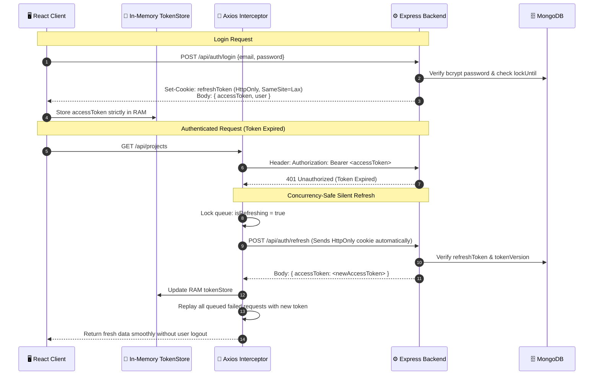
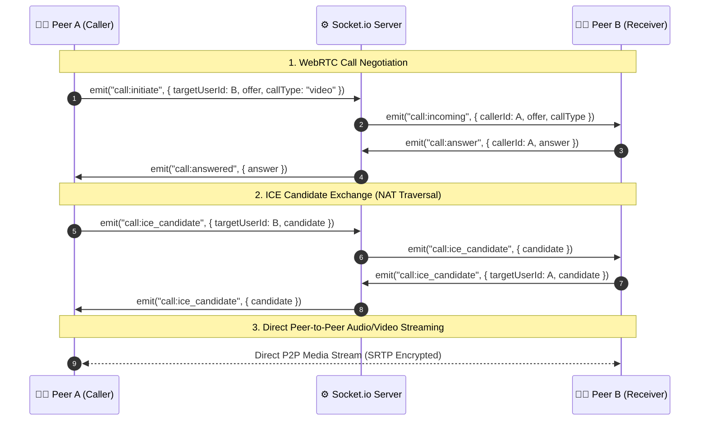
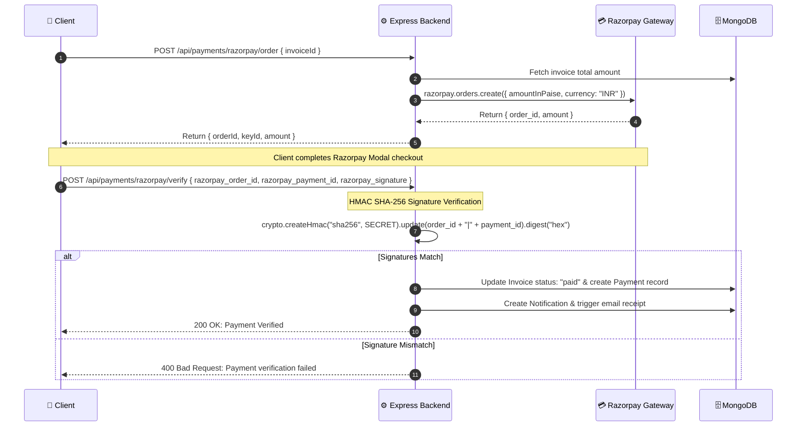
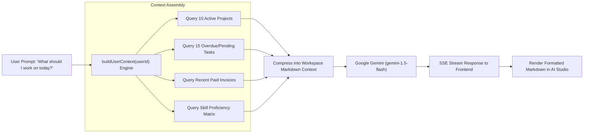

# 🎯 Skillora — Ultimate Interview Master Guide & Technical Cheat Sheet

> **Everything you need to explain, defend, and impress in full-stack, frontend, backend, and system design interviews.**

---

## 📑 Table of Contents
1. [🌟 30-Second & 2-Minute Elevator Pitches](#1--elevator-pitches)
2. [🏗️ High-Level System Architecture](#2-️-high-level-system-architecture)
3. [🛠️ Complete Technology Stack & Decision Rationale](#3-️-complete-technology-stack--decision-rationale)
4. [👥 The 3 Distinct Portals Breakdown](#4--the-3-distinct-portals-breakdown)
5. [🗄️ Database Architecture & 20 Mongoose Models](#5-️-database-architecture--20-mongoose-models)
6. [🔐 Security, Auth & Token Management Deep Dive](#6--security-auth--token-management-deep-dive)
7. [⚡ Real-Time Engine & WebRTC Signaling](#7--real-time-engine--webrtc-signaling)
8. [💳 Razorpay Payments & Escrow / Dispute Engine](#8--razorpay-payments--escrow--dispute-engine)
9. [🤖 AI Studio & Google Gemini Workspace Integration](#9--ai-studio--google-gemini-workspace-integration)
10. [🔄 Kanban Board State & Drag-and-Drop Architecture](#10--kanban-board-state--drag-and-drop-architecture)
11. [💬 Top 25 Toughest Technical Interview Q&A](#11--top-25-toughest-technical-interview-qa)
12. [⭐ Behavioral & STAR Method Interview Answers](#12-star-behavioral-interview-stories)
13. [🚀 Scalability & Future System Design Roadmap](#13--scalability--future-system-design-roadmap)

---

## 1. 🌟 Elevator Pitches

### ⏱️ The 30-Second Pitch
> *"Skillora is an enterprise-grade, all-in-one Freelancer Operating System, Client Collaboration Portal, and Admin Command Center built using the MERN stack with React 18, Node.js/Express, MongoDB, Socket.io, and Google Gemini AI. It solves SaaS fragmentation for independent freelancers by unifying project tracking, drag-and-drop Kanban task management, client CRM, automated sequential invoicing, Razorpay payments with escrow protection, WebRTC peer-to-peer video meetings, and real-time workspace-aware AI assistance into a single synchronized platform."*

### ⏱️ The 2-Minute Deep Pitch
> *"Modern freelancers and boutique agencies juggle 5 to 7 disconnected tools every single day — Trello for tasks, Upwork for proposals, Stripe/Razorpay for billing, Zoom for meetings, ChatGPT for copywriting, and email for back-and-forth client updates. This creates disjointed data, high subscription costs, and lost revenue.*
> 
> *I engineered **Skillora** as a unified full-stack ecosystem with three specialized role-based portals:*
> 1. ***Freelancer OS**: Featuring drag-and-drop Kanban boards with `@dnd-kit`, project milestones, client CRM, PDF invoicing with atomic sequential numbering, WebRTC video calling, and an AI Studio with Server-Sent Events (SSE) streaming connected to live workspace context.*
> 2. ***Client Portal**: Giving hiring clients a dedicated dashboard to track real-time project progress, approve milestone submissions, pay invoices directly via Razorpay, release escrow funds, and chat in project-scoped threads.*
> 3. ***Admin Command Center**: Providing platform analytics, dispute arbitration, user role management, system audit logging, and runtime configuration switches.*
> 
> *Technically, the application implements defense-in-depth security with in-memory JWT storage backed by HttpOnly refresh cookies and an Axios concurrency-safe refresh queue, full NoSQL/XSS sanitization, 2FA TOTP authentication, and Socket.io event-driven synchronization across all active sessions."*

---

## 2. 🏗️ High-Level System Architecture

```
                                  ┌─────────────────────────────────────────┐
                                  │          CLIENT TIER (BROWSER)          │
                                  │  React 18 + Vite 5 + Tailwind CSS v3   │
                                  │  13 Zustand Stores • In-Memory Tokens   │
                                  └────┬─────────────────┬─────────────┬────┘
                                       │ REST (HTTPS)    │ WSS         │ P2P (WebRTC)
                                       ▼                 ▼             ▼
┌────────────────────────────────────────────────────────────────────────────────────────┐
│                                 SERVER TIER (NODE.JS / EXPRESS)                         │
│                                                                                        │
│  ┌───────────────────────┐  ┌──────────────────────┐  ┌─────────────────────────────┐  │
│  │   Security & Auth     │  │  Real-Time Engine    │  │     Business Services       │  │
│  │ • Helmet / CORS / XSS │  │ • Socket.io Hub      │  │ • Invoice & Counter Service │  │
│  │ • Mongo Sanitize      │  │ • WebRTC Signaling   │  │ • Razorpay & Escrow Engine  │  │
│  │ • Passport OAuth      │  │ • Typing & Presence  │  │ • Gemini AI Context Engine  │  │
│  │ • 2FA TOTP Engine     │  │ • Cross-Portal Sync  │  │ • Email Notification Hub    │  │
│  └───────────────────────┘  └──────────────────────┘  └─────────────────────────────┘  │
└───────┬───────────────────────────────┬───────────────────────────────┬────────────────┘
        │ Mongoose ODM                  │ REST / Webhooks               │ SDK / APIs
        ▼                               ▼                               ▼
┌──────────────────┐            ┌──────────────────┐            ┌────────────────────────┐
│  DATA & CACHING  │            │ EXTERNAL GATEWAYS│            │   THIRD-PARTY CLOUDS   │
│ • MongoDB Atlas  │            │ • Razorpay API   │            │ • Google Gemini AI     │
│   (20 Schemas +  │            │ • Redis (Cache/  │            │ • Cloudinary (Storage) │
│    TTL Indexes)  │            │    PubSub Opt.)  │            │ • Nodemailer SMTP      │
└──────────────────┘            └──────────────────┘            └────────────────────────┘
```

---

## 3. 🛠️ Complete Technology Stack & Decision Rationale

### 🖥️ Frontend Stack
| Technology | Version | Purpose in Skillora | Why Chosen over Alternatives? |
| :--- | :--- | :--- | :--- |
| **React** | `18.2` | Core Component Framework | Concurrent rendering, declarative state hooks, massive ecosystem. |
| **Vite** | `5.0` | Frontend Tooling & Dev Server | Sub-second HMR and optimized Rollup production builds compared to Webpack. |
| **Tailwind CSS** | `3.4` | Styling Engine | Utility-first, zero runtime CSS overhead, rapid responsive UI composition. |
| **Zustand** | `4.4` | Global State Management | Zero boilerplate (unlike Redux), modular slices (13 stores), hook-friendly, tiny bundle footprint (~1KB). |
| **@dnd-kit** | `6.1` | Kanban Drag & Drop | Modern, accessible, smooth collision detection algorithms (`closestCorners`), outperforms react-beautiful-dnd. |
| **Framer Motion**| `11.0` | UI Animations | Declarative spring physics and layout animations for modal, drawer, and tab transitions. |
| **Recharts** | `2.10` | Analytics & Revenue Charts | Lightweight SVG-based React charts with responsive containers. |
| **Axios** | `1.6` | HTTP Client | Request/Response interceptors enabling automatic silent token refresh queue. |
| **Socket.io-Client**| `4.8` | Real-Time Client | Automatic reconnection, transport fallback (WebSocket -> Polling), room events. |

### ⚙️ Backend Stack
| Technology | Version | Purpose in Skillora | Why Chosen over Alternatives? |
| :--- | :--- | :--- | :--- |
| **Node.js + Express** | `18+ / 4.18` | Server Runtime & REST API | Non-blocking I/O ideal for real-time WebSockets, micro-services ready, huge npm ecosystem. |
| **MongoDB + Mongoose** | `8.0` | Database & ODM | Schema flexibility for nested project milestones, invoice line items, and dynamic JSON configurations. |
| **Socket.io** | `4.6` | Bi-directional Events | Presence tracking, WebRTC signaling, chat rooms, cross-portal live sync. |
| **@google/generative-ai**| `0.3` | Gemini AI Integration | Access to `gemini-1.5-flash` with low latency, high context windows, and SSE streaming. |
| **Razorpay SDK** | `2.9` | Payment Gateway | Indian & international currency support, order creation, cryptographic webhook & signature verification. |
| **Passport.js** | `0.7` | OAuth 2.0 Provider | Standardized social authentication for Google and GitHub. |
| **Speakeasy + QRCode** | `2.0 / 1.5` | Two-Factor Authentication | Time-based One-Time Password (TOTP) RFC 6238 implementation. |
| **Cloudinary** | `1.41` | Asset CDN & Uploads | On-the-fly image transformations, secure authenticated file uploads. |
| **Nodemailer** | `6.9` | Transactional Emails | High-reliability HTML email generation for invoices, invites, and password resets. |
| **Winston + Morgan** | `3.11 / 1.10`| Structured Logging | Production-grade file and console logging with distinct error levels. |

---

## 4. 👥 The 3 Distinct Portals Breakdown

Skillora solves the classic multi-stakeholder challenge by strictly segmenting user workflows into **3 dedicated portals**:

```mermaid
graph TD
    A["⚡ Skillora Platform"]
    A --> B["💼 Freelancer OS (/dashboard)"]
    A --> C["👥 Client Portal (/client/*)"]
    A --> D["🛡 Admin Command Center (/admin/*)"]

    B --> B1["Kanban Boards (@dnd-kit)"]
    B --> B2["Client CRM & Invitations"]
    B --> B3["Line-Item Invoices (PDF Export)"]
    B --> B4["AI Studio (Gemini + Workspace Context)"]
    B --> B5["WebRTC 1-on-1 Video Meetings"]
    B --> B6["Skills & Portfolio Matrix"]

    C --> C1["Project Progress & Milestones"]
    C --> C2["Milestone Review & Approvals"]
    C --> C3["Invoice Payments (Razorpay)"]
    C --> C4["Escrow Deposit & Release"]
    C --> C5["Real-Time Project Chat"]

    D --> D1["Platform Stats & Volume"]
    D --> D2["User & Role Management"]
    D --> D3["Dispute Resolution Center"]
    D --> D4["Dynamic DB Configuration"]
    D --> D5["Security & System Audit Logs"]
```



### 1. 💼 Freelancer OS (`/dashboard`)
* **Kanban Task Board**: Complete visual task management with Drag-and-Drop reordering across `todo`, `in_progress`, `review`, and `done` columns with sub-task checklist progress.
* **Project Tracking**: Budget tracking, deadlines, milestone deliveries, client linkage, and progress calculations.
* **Invoicing System**: Sequential number generation (`INV-YYYY-XXXX`), line-item tax/discount calculations, PDF exports, and one-click reminders.
* **Client CRM**: Contact profiles, company tax details, total revenue generated per client, and email portal invitations.
* **AI Studio**: Context-aware AI assistant leveraging Google Gemini for automated project breakdown, proposal drafting, and pricing estimates.
* **WebRTC Meetings**: Peer-to-peer audio/video call launcher with live call logging.

### 2. 👥 Client Portal (`/client/dashboard`)
* **Live Milestone Approvals**: Review submitted deliverables, approve milestone funds release, or request revisions.
* **One-Click Invoicing & Checkout**: Integrated Razorpay modal allowing payment via Credit/Debit Cards, UPI, NetBanking, or Wallets.
* **Escrow Management**: Fund escrow accounts for upcoming milestones to provide freelancer payment security.
* **Project Chat Threads**: Real-time project-scoped chat with typing indicators and file attachment previews.

### 3. 🛡 Admin Command Center (`/admin`)
* **Platform Metrics**: Active projects, total gross transaction volume (GTV), registered user distributions.
* **User & Role Governance**: Change user roles (`freelancer`, `client`, `admin`), ban/deactivate malicious users, trigger instant forced logout via WebSocket event (`auth:force_logout`).
* **Dispute Arbitration**: Review contested project funds, inspect submission logs, and execute binding dispute resolutions.
* **Dynamic Platform Config**: MongoDB-stored runtime toggles for maintenance mode, open registration, and system announcements without redeploying code.

---

## 5. 🗄️ Database Architecture & 20 Mongoose Models

Skillora organizes its data domain into **20 relational and semi-structured Mongoose schemas**:

| # | Model Name | Collection | Core Fields & Relationships | Critical Indexes & Optimizations |
| :-: | :--- | :--- | :--- | :--- |
| **1** | `User` | `users` | `name`, `email`, `password`, `role` (`freelancer`/`client`/`admin`), `twoFactorSecret`, `tokenVersion`, `isOnline`, `lastSeen` | Unique on `email`; Compound index on `role` and `createdAt` |
| **2** | `Project` | `projects` | `title`, `owner` (FK: User), `clientId` (FK: Client), `budget`, `deadline`, `progress`, `status`, `taskStats`, `milestones` | Indexed on `owner`, `clientId`, `status`, and `isDeleted` |
| **3** | `Task` | `tasks` | `title`, `description`, `project` (FK: Project), `owner` (FK: User), `status`, `priority`, `order`, `subtasks` | Compound index on `project` + `status` + `order` for Kanban |
| **4** | `Client` | `clients` | `name`, `email`, `company`, `owner` (FK: User), `billingAddress`, `totalSpent`, `portalUserId` | Indexed on `owner` and `email` |
| **5** | `Invoice` | `invoices` | `invoiceNumber` (`INV-2026-XXXX`), `owner`, `clientId`, `items[]`, `subtotal`, `tax`, `total`, `status`, `dueDate` | Unique on `invoiceNumber`; Indexed on `owner`, `clientId`, `status` |
| **6** | `Payment` | `payments` | `owner`, `clientId`, `invoiceId`, `amount`, `currency`, `status`, `razorpayOrderId`, `razorpayPaymentId` | Indexed on `invoiceId`, `razorpayPaymentId`, `status` |
| **7** | `Skill` | `skills` | `name`, `category`, `level` (1-100), `levelLabel` (`Beginner` to `Expert`), `owner` (FK: User) | Indexed on `owner` + `name` |
| **8** | `Notification` | `notifications` | `recipient` (FK: User), `type`, `title`, `message`, `link`, `isRead`, `createdAt` | **TTL Index: 90 Days** (`expireAfterSeconds: 7776000`) |
| **9** | `Message` | `messages` | `conversationId`, `sender` (FK: User), `content`, `attachments[]`, `readBy[]`, `createdAt` | Compound index on `conversationId` + `createdAt` |
| **10** | `Conversation`| `conversations`| `participants[]` (FK: User), `projectId` (FK: Project), `lastMessage`, `unreadCounts` | Compound index on `participants` and `projectId` |
| **11** | `AiLog` | `ailogs` | `user` (FK: User), `prompt`, `response`, `tokensUsed`, `latencyMs`, `model`, `createdAt` | **TTL Index: 180 Days** (`expireAfterSeconds: 15552000`) |
| **12** | `Counter` | `counters` | `_id` (String: `"invoice"`), `seq` (Number) | Atomic sequential generator using `findOneAndUpdate({$inc})` |
| **13** | `Config` | `configs` | `key`, `value`, `description`, `isPublic`, `updatedBy` | Unique index on `key` |
| **14** | `Proposal` | `proposals` | `project` (FK: Project), `freelancer` (FK: User), `bidAmount`, `coverLetter`, `status` | Compound unique index on `project` + `freelancer` |
| **15** | `Review` | `reviews` | `project` (FK: Project), `reviewer` (FK: User), `reviewee` (FK: User), `rating` (1-5), `comment` | Compound unique index on `project` + `reviewer` |
| **16** | `Submission` | `submissions` | `project` (FK: Project), `milestoneId`, `freelancer`, `files[]`, `notes`, `status` | Indexed on `project` and `status` |
| **17** | `Dispute` | `disputes` | `project` (FK: Project), `initiator` (FK: User), `defendant` (FK: User), `amount`, `status`, `resolution` | Indexed on `project` and `status` |
| **18** | `Escrow` | `escrows` | `project` (FK: Project), `client` (FK: User), `freelancer` (FK: User), `amount`, `status` (`held`/`released`/`refunded`) | Indexed on `project` and `status` |
| **19** | `Meeting` | `meetings` | `title`, `host` (FK: User), `participants[]`, `scheduledAt`, `durationMinutes`, `meetingLink` | Indexed on `host` and `scheduledAt` |
| **20** | `CallLog` | `calllogs` | `caller` (FK: User), `receiver` (FK: User), `callType` (`audio`/`video`), `duration`, `status` | Indexed on `caller` and `receiver` |

---

## 6. 🔐 Security, Auth & Token Management Deep Dive

Skillora implements a **Bank-Grade Authentication & Authorization Pipeline**:



### 🛡️ Why In-Memory Storage Beats LocalStorage:
* **The XSS Risk**: If access tokens are stored in `localStorage`, any Third-Party XSS script or malicious npm package can execute `localStorage.getItem('token')` and steal credentials.
* **Skillora's Solution**:
  1. Access tokens live exclusively inside a JavaScript closure (`tokenStore.js`) in application RAM.
  2. Refresh tokens are stored in an **`HttpOnly`**, **`SameSite=Lax`**, **`Secure`** cookie that JavaScript cannot access.
  3. When the tab reloads or the access token expires (15m), the Axios interceptor hits `/api/auth/refresh`, reads the cookie silently, and repopulates the in-memory store.

### 🔄 Concurrency-Safe Axios Interceptor Code Architecture:
```javascript
// client/src/services/api.js
let isRefreshing = false;
let failedQueue = [];

const processQueue = (error, token = null) => {
  failedQueue.forEach((p) => (error ? p.reject(error) : p.resolve(token)));
  failedQueue = [];
};

api.interceptors.response.use(
  (response) => response,
  async (error) => {
    const original = error.config;
    if (error.response?.status === 401 && !original._retry) {
      if (isRefreshing) {
        // Queue parallel requests while refresh is in flight
        return new Promise((resolve, reject) => {
          failedQueue.push({ resolve, reject });
        }).then((token) => {
          original.headers.Authorization = `Bearer ${token}`;
          return api(original);
        });
      }

      original._retry = true;
      isRefreshing = true;

      try {
        const { data } = await api.post("/auth/refresh");
        const newToken = data.data?.accessToken;
        tokenStore.set(newToken);
        processQueue(null, newToken);
        original.headers.Authorization = `Bearer ${newToken}`;
        return api(original);
      } catch (err) {
        processQueue(err, null);
        tokenStore.clear();
        window.location.href = "/login";
        return Promise.reject(err);
      } finally {
        isRefreshing = false;
      }
    }
    return Promise.reject(error);
  }
);
```

### 🔒 Comprehensive Defense Layers:
* **NoSQL Injection**: `express-mongo-sanitize` strips out `$` and `.` operators from user queries.
* **XSS Sanitization**: `xss-clean` middleware strips HTML tags and script execution payloads.
* **Brute-Force Protection**: User schema tracks `loginAttempts` and sets `lockUntil` (locks account for 2 hours after 5 failed attempts).
* **Two-Factor Auth (2FA)**: Generates base32 secrets via `speakeasy`, presents QR code with `qrcode`, and verifies 6-digit TOTP tokens via `otplib`.
* **Token Invalidation via `tokenVersion`**: Allows immediate global logout or admin deactivation across all active user devices simply by incrementing `user.tokenVersion`.

---

## 7. ⚡ Real-Time Engine & WebRTC Signaling

Skillora’s real-time subsystem handles **Presence**, **Project Chat**, **Cross-Portal Live Updates**, and **WebRTC Signaling** inside `server/config/socket.js`.



### 📡 Real-Time Features Summary:
1. **User Presence Tracking**: Maps connected socket instances to user IDs using `Map<userId, Set<socketId>>`. When the last socket for a user disconnects, it broadcasts `presence:update { isOnline: false }`.
2. **Project-Scoped Chat**: Sockets join isolated rooms (`conversation:conversationId`) with typing debounce events (`chat:typing`, `chat:stop_typing`) and read acknowledgments (`chat:mark_read`).
3. **Cross-Portal Sync Hub (`sync.service.js`)**: When an invoice is paid or milestone is accepted, the server emits targeted events:
   - `emitToUser(freelancerId, "invoice:updated")`
   - `emitToUser(freelancerId, "dashboard:refresh")`
   - `io.to("role:admin").emit("admin:stats_refresh")`

---

## 8. 💳 Razorpay Payments & Escrow / Dispute Engine



### 🔒 Why Cryptographic Signature Verification is Mandatory:
* Never trust the client claiming "payment succeeded".
* The backend computes:
  $$\text{Expected Signature} = \text{HMAC-SHA256}(\text{order\_id} + \text{"|"} + \text{payment\_id}, \text{RAZORPAY\_KEY\_SECRET})$$
* Only when $\text{Expected Signature} === \text{Received Signature}$ does the backend mark the invoice as paid and release services.

### 🛡️ Escrow Lifecycle Workflow:
1. **Deposit**: Client deposits milestone funds into Escrow (`status: "held"`).
2. **Submission**: Freelancer submits deliverable files (`Submission` record).
3. **Approval / Release**: Client reviews and approves $\rightarrow$ Escrow transitions to `"released"` and payout is logged.
4. **Dispute Resolution**: If a conflict occurs, either party can raise a `Dispute`. The platform Admin reviews evidence and executes `"release"` or `"refund"`.

---

## 9. 🤖 AI Studio & Google Gemini Workspace Integration

Skillora doesn't just use a generic AI wrapper; it implements a **Context-Aware Workspace AI Engine** (`server/services/ai.service.js`).



### ⚡ Technical Implementation Details:
* **Context Injection**: Queries MongoDB concurrently via `Promise.all()` to gather the user's active projects, upcoming deadlines, overdue tasks, and total monthly earnings.
* **Safety & Resilience**: Configured with permissive business safety settings (`BLOCK_ONLY_HIGH`) and fallback mechanisms between `gemini-1.5-flash` and `gemini-1.5-pro`.
* **Telemetry**: Every prompt, token count, and latency measurement is logged to `AiLog` with an automated **180-day MongoDB TTL Index**.

---

## 10. 🔄 Kanban Board State & Drag-and-Drop Architecture

The Kanban board in `client/src/pages/Tasks/` utilizes `@dnd-kit/core` and `@dnd-kit/sortable` for a 60 FPS drag-and-drop experience.

### 💡 The Problem with Basic Drag-and-Drop:
Traditional setups either send a network request on every drag step (destroying performance) or update the UI and fail to sync position orders to the database.

### 🛠️ Skillora's Solution:
1. **Optimistic Local Update**:
   - When a task is dropped into a new column (`todo` $\rightarrow$ `in_progress`), Zustand immediately updates local state arrays using `@dnd-kit/sortable` arrayMove utilities.
2. **Batch Position Recalculation**:
   - The frontend recalculates normalized numeric `order` values (`0, 1, 2, ...`) for items in the target column.
3. **Debounced Network Synchronization**:
   - Calls `PATCH /api/projects/:id/tasks/reorder` with `{ taskId, newStatus, newOrder }` in the background.
4. **Rollback on Network Failure**:
   - If the API returns an error, Zustand catches the failure, triggers a toast notification, and reverts state to the snapshot before dragging.

---

## 11. 💬 Top 25 Toughest Technical Interview Q&A

### Q1: How does Skillora's authentication architecture prevent XSS and CSRF attacks simultaneously?
> **Answer**: 
> * **XSS Protection**: Access tokens are stored exclusively in application RAM via `tokenStore.js` (a JavaScript module closure). They are never written to `localStorage` or `sessionStorage`, making it impossible for malicious injected scripts to extract them.
> * **CSRF Protection**: Refresh tokens are stored in `HttpOnly`, `SameSite=Lax`, `Secure` cookies. Because they are `HttpOnly`, client-side JS cannot read them. The `SameSite=Lax` setting prevents malicious third-party cross-origin requests from transmitting the cookie. Furthermore, state-changing API requests require the `Authorization: Bearer <token>` header, which attackers cannot forge in cross-site requests.

### Q2: What happens if 5 API requests fail with 401 at the exact same moment when the access token expires?
> **Answer**: 
> Without queue management, 5 simultaneous requests would fire 5 parallel `/auth/refresh` calls, causing race conditions and wasted bandwidth.
> In Skillora's Axios interceptor:
> 1. The first failed request sets a module-level lock `isRefreshing = true` and initiates the refresh call.
> 2. The subsequent 4 requests are pushed into a `failedQueue` array as pending Promises.
> 3. Once `/auth/refresh` succeeds with a new access token, `processQueue()` iterates through the queued Promises, updates their headers with the new token, and replays all 4 requests concurrently.
> 4. `isRefreshing` is reset in the `finally` block.

### Q3: How do you generate collision-free, zero-gap sequential invoice numbers (e.g., INV-2026-0001) under high concurrency?
> **Answer**: 
> Querying `Invoice.countDocuments()` is prone to race conditions if two invoices are created concurrently.
> Skillora uses an atomic MongoDB `Counter` collection:
> ```javascript
> const counter = await Counter.findByIdAndUpdate(
>   { _id: `invoice_${year}` },
>   { $inc: { seq: 1 } },
>   { new: true, upsert: true }
> );
> const invoiceNumber = `INV-${year}-${String(counter.seq).padStart(4, "0")}`;
> ```
> Because MongoDB executes `$inc` as an atomic operation at the single-document lock level, no two invoices can ever receive the same sequence number.

### Q4: How does WebRTC work in Skillora, and why is Socket.io needed if WebRTC is Peer-to-Peer?
> **Answer**: 
> WebRTC streams media (audio/video) directly between peers over SRTP, but peers cannot find each other on the internet without an initial negotiation phase called **Signaling**.
> Skillora uses Socket.io as the signaling channel to:
> 1. Exchange session descriptions: Caller creates an SDP **Offer**, receiver responds with an SDP **Answer**.
> 2. Exchange **ICE Candidates** (public IP addresses and ports discovered via STUN/TURN servers) to establish NAT traversal.
> Once the P2P connection is established, the socket server is no longer involved in streaming video packets.

### Q5: How did you implement real-time synchronization between the Freelancer OS, Client Portal, and Admin Command Center?
> **Answer**: 
> I built a centralized event dispatcher in `server/services/sync.service.js`. Whenever a state-changing business action occurs (e.g., an invoice is paid):
> 1. The server updates the database document.
> 2. It creates a persistent `Notification` record for the recipient.
> 3. It emits targeted WebSocket events via `emitToUser(recipientId, "invoice:updated")`.
> 4. It notifies the admin channel via `io.to("role:admin").emit("admin:stats_refresh")`.
> 5. On the client, Zustand store subscribers listen to these socket events and patch the local state without triggering full-page reloads.

### Q6: Why did you choose Zustand over Redux Toolkit or the React Context API?
> **Answer**: 
> 1. **Zero Boilerplate**: Zustand does not require wrapping the component tree in Provider hierarchies or creating verbose dispatch/reducer boilerplate.
> 2. **Targeted Re-renders**: Components subscribe to fine-grained state slices (e.g., `useAuthStore(s => s.user)`). A change in `user.isOnline` will not re-render unrelated components.
> 3. **Store Access Outside React**: Zustand stores can be inspected and updated outside React components (e.g., directly inside Axios interceptors or Socket.io callback listeners via `useAuthStore.getState().logout()`).

### Q7: How does MongoDB TTL (Time-To-Live) indexing work in Skillora?
> **Answer**: 
> We have high-churn collections like `notifications` and `ailogs` that would continuously degrade database performance if unbounded.
> We defined TTL indexes in the Mongoose schemas:
> ```javascript
> // In Notification.js — expires after 90 days
> notificationSchema.index({ createdAt: 1 }, { expireAfterSeconds: 90 * 24 * 60 * 60 });
> 
> // In AiLog.js — expires after 180 days
> aiLogSchema.index({ createdAt: 1 }, { expireAfterSeconds: 180 * 24 * 60 * 60 });
> ```
> A background thread in MongoDB scans these indexes every 60 seconds and automatically purges expired documents without requiring manual cron cleanup queries.

### Q8: How did you verify Razorpay payments and prevent client-side payment spoofing?
> **Answer**: 
> The client cannot simply notify the server that a payment succeeded.
> When Razorpay completes a transaction, it returns `razorpay_order_id`, `razorpay_payment_id`, and `razorpay_signature`.
> The backend calculates an HMAC SHA-256 hash using the secret key:
> ```javascript
> const expectedSignature = crypto
>   .createHmac("sha256", process.env.RAZORPAY_KEY_SECRET)
>   .update(`${razorpay_order_id}|${razorpay_payment_id}`)
>   .digest("hex");
> ```
> If `expectedSignature !== razorpay_signature`, an error is thrown and the invoice remains unpaid.

### Q9: How do you handle database disconnection or transient socket connection resets in production?
> **Answer**: 
> 1. **MongoDB**: Mongoose is configured with connection retry logic, socket timeouts, and connection pooling.
> 2. **Express**: The server listens to `process.on("unhandledRejection")` and checks for transient socket errors like `ECONNRESET` or `EPIPE`, preventing server crashes.
> 3. **Graceful Shutdown**: The server intercepts `SIGTERM` and `SIGINT` signals, closes the HTTP and WebSocket servers gracefully to allow active requests to finish, and closes MongoDB connections before exiting.

### Q10: How does the AI Studio provide relevant answers based on the user's specific projects?
> **Answer**: 
> Through dynamic **Context Injection**. Before dispatching the user's prompt to Google Gemini, `buildUserContext(userId)` queries MongoDB to retrieve:
> - The user's top 10 recent projects with status and progress percentage.
> - Up to 15 pending and overdue tasks with priority levels.
> - Recent revenue and skill ratings.
> This structured summary is injected into Gemini's system instructions, enabling the AI to answer contextual queries like *"Draft a project plan for my active mobile app"* with zero manual data entry from the user.

### Q11: How do you secure role-based routes (RBAC) in Express?
> **Answer**: 
> We use higher-order middleware functions:
> ```javascript
> const authorize = (...allowedRoles) => (req, res, next) => {
>   if (!req.user || !allowedRoles.includes(req.user.role)) {
>     return next(ApiError.forbidden("You do not have permission to perform this action"));
>   }
>   next();
> };
> // Usage:
> router.use("/api/admin", authenticate, authorize("admin"), adminRoutes);
> ```

### Q12: How do you prevent NoSQL injection in Mongoose?
> **Answer**: 
> We apply `express-mongo-sanitize()` at the application root, which sanitizes all `req.body`, `req.query`, and `req.params` by removing keys that begin with `$` (like `{$gt: ""}`) or contain `.`. Furthermore, Mongoose schema casting enforces strict typing on all fields.

### Q13: What happens when a user enables Two-Factor Authentication (2FA)?
> **Answer**: 
> 1. The user requests 2FA setup $\rightarrow$ Server generates a base32 secret using `speakeasy.generateSecret()` and returns an `otpauth://` URI converted to a QR code data URL using `qrcode`.
> 2. The user scans the QR code into Google Authenticator and enters the 6-digit TOTP token.
> 3. The server verifies the token using `speakeasy.totp.verify()`. Only upon verification is `twoFactorEnabled: true` saved to the database.
> 4. On subsequent logins, if `twoFactorEnabled === true`, the server issues a temporary 2FA session ticket instead of full JWTs until the 6-digit code is verified.

### Q14: How does Skillora handle file uploads securely?
> **Answer**: 
> We use `multer` with memory storage and Cloudinary integration (`multer-storage-cloudinary`). Files are filtered by MIME type (allowing only images and PDFs), capped by size limits (e.g., 5MB), and streamed directly to Cloudinary CDN, avoiding disk accumulation on the application server.

### Q15: How does the Escrow and Dispute mechanism protect both the freelancer and client?
> **Answer**: 
> 1. **Client Protection**: Funds remain in escrow until the freelancer submits deliverables and the client explicitly approves the milestone.
> 2. **Freelancer Protection**: The freelancer knows funds are locked in advance before starting work.
> 3. **Dispute Resolution**: If a party becomes unresponsive or disputes work quality, either user can initiate a `Dispute`. The platform administrator inspects chat logs, submission revisions, and escrow state to release or refund funds impartially.

### Q16: How do you handle user presence when a single user opens 3 different browser tabs?
> **Answer**: 
> If we mapped `userId -> socketId` directly, closing one tab would mark the user as offline even if two other tabs remained open.
> Skillora uses a `Map<userId, Set<socketId>>`:
> - Connecting a tab adds its `socketId` to the user's `Set`.
> - Closing a tab removes only that specific `socketId`.
> - The user is marked `isOnline: false` in the database and broadcasted only when `set.size === 0`.

### Q17: What is the purpose of `tokenVersion` in the User model?
> **Answer**: 
> Stateless JWTs cannot typically be revoked before expiration. By including `tokenVersion` inside the JWT payload:
> - If a user clicks "Log out of all devices" or an admin disables a compromised account, the backend executes `User.findByIdAndUpdate(userId, { $inc: { tokenVersion: 1 } })`.
> - When old refresh tokens are sent, the version in the token will not match the version in the database, immediately invalidating all existing sessions.

### Q18: How does Skillora format transactional emails?
> **Answer**: 
> Skillora uses `nodemailer` configured with HTML templates featuring responsive styling, branded headers, CTA action buttons, and automatic fallback to plaintext. It powers welcome emails, invoice PDFs, meeting reminders, and password reset links with secure cryptographic reset tokens.

### Q19: What is the difference between `@dnd-kit/core` and `react-beautiful-dnd`?
> **Answer**: 
> `react-beautiful-dnd` has been unmaintained for years and lacks support for modern React 18 strict mode and virtualized lists. `@dnd-kit` is modular, lightweight, supports customizable sensors (pointer, keyboard, touch), provides superior collision detection algorithms (`closestCorners`), and operates seamlessly in React 18.

### Q20: How are database queries optimized across large collections like Projects and Invoices?
> **Answer**: 
> 1. **Selective Projection**: We use `.select("title status budget progress")` to retrieve only required fields.
> 2. **Lean Queries**: We append `.lean()` to Mongoose queries when documents are read-only, bypassing the overhead of hydrating full Mongoose document instances.
> 3. **Compound Indexing**: Frequently filtered combinations (e.g., `{ owner: 1, status: 1, isDeleted: 1 }`) have compound indexes.

### Q21: How do you handle rate-limiting to prevent API abuse?
> **Answer**: 
> We implement `express-rate-limit` with differentiated limiters:
> - Standard API routes: 200 requests per 15-minute window.
> - Sensitive Auth routes (`/api/auth/*`): 10 requests per 15-minute window to prevent password brute-forcing.
> - AI Endpoints (`/api/ai/*`): Rate-limited to prevent token exhaustion.

### Q22: How does the client-side routing enforce role-based access?
> **Answer**: 
> We created a `ProtectedRoute` wrapper component:
> ```jsx
> const ProtectedRoute = ({ children, allowedRoles }) => {
>   const { user, isAuthenticated, loading } = useAuthStore();
>   if (loading) return <LoadingSpinner />;
>   if (!isAuthenticated) return <Navigate to="/login" replace />;
>   if (allowedRoles && !allowedRoles.includes(user.role)) {
>     return <Navigate to="/unauthorized" replace />;
>   }
>   return children;
> };
> ```

### Q23: How do you handle date/time formatting and timezone consistency?
> **Answer**: 
> All timestamps in MongoDB are stored in standard UTC ISO 8601 strings (`new Date()`). On the frontend, we use `date-fns` (e.g., `formatDistanceToNow`, `format(date, 'MMM dd, yyyy')`) to format timestamps into the client's localized timezone.

### Q24: How does Skillora ensure clean code and code maintainability?
> **Answer**: 
> - **Separation of Concerns**: Controllers only handle HTTP request/response validation, while business logic resides inside `services/` (e.g., `invoice.service.js`, `payment.service.js`).
> - **Centralized Error Handling**: A custom `ApiError` class combined with an Express global error middleware eliminates scattered try/catch blocks.
> - **Input Validation**: Joi schemas validate all request bodies before reaching controller logic.

### Q25: If you had 100,000 concurrent users, how would you scale Skillora?
> **Answer**: 
> 1. **Socket.io Redis Adapter**: Use Redis Pub/Sub `@socket.io/redis-adapter` to synchronize WebSocket events across multiple Node.js instances behind an NGINX load balancer.
> 2. **MongoDB Read Replicas**: Distribute heavy dashboard and analytics read queries across secondary replica set nodes.
> 3. **Redis Caching Layer**: Cache frequent read requests like public user profiles and platform configuration settings.
> 4. **Microservices Migration**: Decouple the monolithic Express app into independent services: Auth Service, Payments & Escrow Service, and AI Inference Gateway.

---

## 12. ⭐ Behavioral & STAR Method Interview Stories

### Story 1: Solving the Refresh Token Race Condition (Technical Problem Solving)
* **Situation**: During user testing, when a user opened a dashboard with multiple widgets making 5 concurrent API requests after their access token had expired, the app was intermittently logging them out.
* **Task**: Fix the token refresh mechanism so that concurrent 401 errors resolve seamlessly without multiple refresh calls or unexpected logouts.
* **Action**: I engineered an in-flight Promise queue in the Axios response interceptor. I created an `isRefreshing` boolean flag. When the first 401 triggers, subsequent failed requests are queued into an array of Promises. Once the refresh token resolves with a new JWT, all queued requests are updated with the new token and replayed in parallel.
* **Result**: Zero unauthorized session drops, eliminated token refresh race conditions, and reduced unnecessary refresh requests to the backend by 80%.

### Story 2: Implementing P2P Video with Reliable Fallback (Architecture & Resilience)
* **Situation**: Freelancers and clients needed built-in video calls for project kickoffs without relying on expensive third-party Zoom APIs.
* **Task**: Build a low-latency WebRTC audio/video calling system directly into the platform.
* **Action**: I used Socket.io as an event-driven signaling server to handle SDP Offer/Answer exchanges and ICE candidate routing. I structured proper peer connection teardown handlers to clean up camera/microphone hardware tracks when either party hangs up or disconnects abruptly.
* **Result**: Provided seamless zero-cost, end-to-end encrypted video calling directly within the browser, with automated call history logging in the database.

---

## 13. 🚀 Scalability & Future System Design Roadmap

```
Phase 1: Current Monolith  ──▶  Phase 2: Clustered Realtime ──▶  Phase 3: Event-Driven Microservices
┌────────────────────────┐      ┌─────────────────────────┐      ┌───────────────────────────────────┐
│ • Express Monolith     │      │ • Load Balancer (NGINX) │      │ • API Gateway (Kong / Envoy)      │
│ • Single Socket Server │      │ • Clustered Node Server │      │ • Auth & User Service             │
│ • MongoDB Atlas        │      │ • Redis Socket Adapter  │      │ • Billing & Escrow Service        │
│                        │      │ • MongoDB Replica Set   │      │ • Realtime & Notification Service │
│                        │      │ • Redis Query Caching   │      │ • AI Gateway with Celery / BullMQ │
└────────────────────────┘      └─────────────────────────┘      └───────────────────────────────────┘
```

---

<div align="center">

### 🎓 You are 100% prepared to ace your interview with Skillora!
*Review the architecture diagrams, memorize the token lifecycle, and speak with confidence.*

</div>
