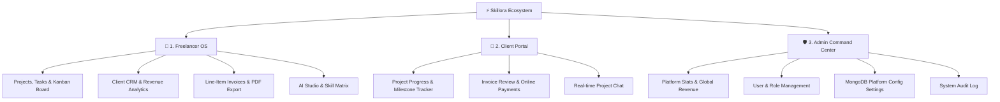
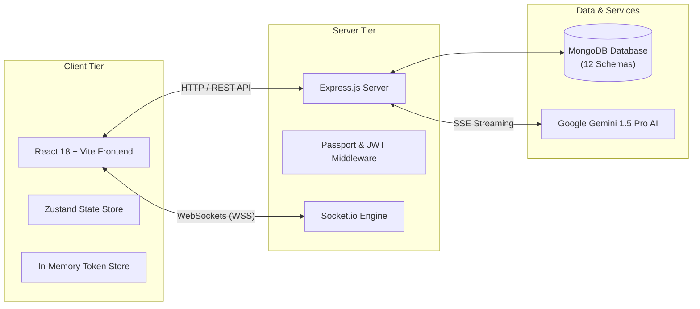
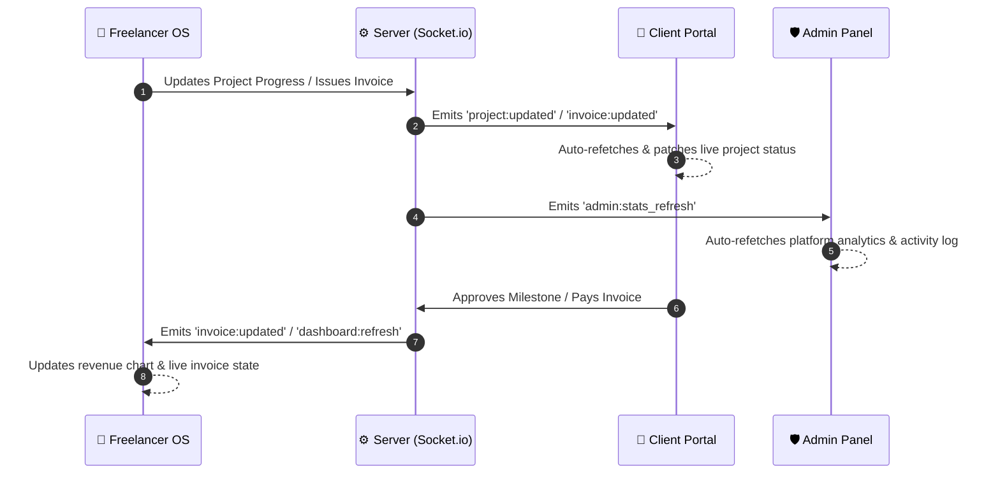

<div align="center">

# ⚡ Skillora — Freelancer OS & Client Portal

### *A Production-Grade, 100% Free Workspace for Freelancers, Admins & Clients*

Manage clients, projects, tasks, invoices, payments, real-time sync, and AI-powered productivity — all in one seamless ecosystem.

<br/>

[](.)
[](.)
[](.)
[](.)
[](.)
[](.)
[](.)
[](.)

<br/>

[📖 Overview](#-what-is-skillora) · [🌟 Key Features](#-key-features) · [🖥 The 3 Portals](#-the-3-dashboards-at-a-glance) · [🏗 Architecture](#-system-architecture--real-time-sync) · [🚀 Quick Start](#-quick-start-3-step-setup) · [🔌 API Reference](#-complete-api-reference) · [🗄 Database Schemas](#-database-schemas-explained) · [📁 Directory Tree](#-project-structure)

</div>

---

## 📖 What is Skillora?

**Skillora** is an all-in-one management platform built to unify freelancer workflows, client collaboration, and platform administration into a single high-performance application.

Instead of subscribing to multiple disconnected software suites for project tracking, task boards, client communication, invoice generation, and AI assistance, Skillora integrates everything into **one synchronized workspace**.

> 💡 **100% Free Forever**: All features — including unlimited projects, client portals, line-item invoicing, AI prompt studios, real-time chat, and admin configuration — are completely unlocked with no paywalls or hidden tier limits.

---

## 🌟 Key Features

- 💼 **Freelancer OS**: Drag-and-drop Kanban boards (`@dnd-kit`), project progress metrics, client CRM, invoice generator, and technical skill matrix.
- 👥 **Dedicated Client Portal**: Secure client interface to review project progress, approve/request changes on milestones, view/pay invoices online, and chat directly with freelancers.
- 🛡 **Admin Command Center**: Complete oversight of registered users, revenue statistics, live activity logs, and MongoDB-persisted platform configuration (Maintenance Mode, Registration rules, Support contacts).
- ⚡ **Real-Time Socket Synchronization**: Bi-directional updates using Socket.io so changes on one dashboard instantaneously reflect across all active sessions.
- 🤖 **Google Gemini 1.5 Pro AI Studio**: Native AI assistance supporting Server-Sent Events (SSE) streaming for generating project breakdown structures, task checklists, and smart summaries.
- 🔐 **Bank-Grade Authentication**: OAuth 2.0 (Google & GitHub) + JWT architecture featuring **in-memory access tokens** (`tokenStore.js`) and HttpOnly SameSite=Strict refresh cookies for maximum security against XSS & CSRF attacks.

---

## 🖥 The 3 Dashboards at a Glance

Skillora provides dedicated, role-specific interfaces tailored for each user type:



### 1. 💼 Freelancer OS (`/dashboard`)
- **Project & Task Management**: Interactive Kanban boards with drag-and-drop support (`@dnd-kit`), task priorities, checklist completion tracking, and automatic project progress calculation.
- **Client CRM**: Manage client contacts, company billing profiles, total billed revenue, and project history.
- **Invoice & Payments**: Professional line-item invoice builder with automatic sequential numbering (`INV-2026-0001`), invoice status lifecycle (`Draft` → `Sent` → `Viewed` → `Paid` → `Overdue`), and PDF rendering.
- **Skill Portfolio Matrix**: Track technical skills with auto-calculated proficiency levels (Beginner → Expert).
- **AI Studio**: Integrated Google Gemini 1.5 Pro AI assistant for task generation, project scoping, and invoice descriptions with live streaming responses.

### 2. 👥 Client Portal (`/client/dashboard`)
- **Project & Milestone Progress**: View real-time completion percentages, task statuses, and approve/request changes on milestone deliverables.
- **Invoice Review & Payments**: Access sent invoices, view detailed line items, and process payments securely online (Stripe, PayPal, Bank Transfer).
- **Direct Client Messaging**: Real-time project discussion threads powered by Socket.io.
- **Notifications**: Instant notification alerts when new invoices are issued, milestones are updated, or messages arrive.

### 3. 🛡 Admin Command Center (`/admin`)
- **System Analytics**: Platform-wide metrics including total registered users, active projects, volume processed, and real-time user activity.
- **User Control**: Search/filter users by role (`freelancer`, `client`, `admin`), update account statuses (active/suspended), or modify user roles.
- **MongoDB Persisted Config**: Dynamic settings management (`Config` schema) controlling system maintenance mode, public registration toggles, and global support contacts.
- **Audit Log**: System event log tracking user registrations, role updates, and administrative actions.

---

## 🏗 System Architecture & Real-Time Sync

### Overall Architecture



### Real-Time Socket.io Event Flow

All 3 dashboards stay synchronized in real-time using Socket.io event dispatches (`useSyncEvents.js`):



---

## 🔒 Enterprise Security Architecture

Skillora implements modern web security practices:

- **In-Memory Access Tokens**: Access JWTs are kept strictly in JavaScript memory (`tokenStore.js`) and never stored in `localStorage` or `sessionStorage`, completely insulating the app from XSS token theft.
- **HttpOnly Refresh Cookies**: Refresh tokens are stored in secure, `HttpOnly`, `SameSite=Strict` cookies for automatic silent token rotation.
- **NoSQL Injection Prevention**: Requests pass through `express-mongo-sanitize` to strip prohibited `$` or `.` operators.
- **XSS Attack Defense**: Sanitized payloads using `xss-clean`.
- **API Rate Limiting**: Dedicated rate limiters (`express-rate-limit`) protect sensitive auth routes (`/api/auth/*`) and general endpoints against brute-force attacks.
- **HTTP Security Headers**: Powered by `helmet` to set secure CSP, HSTS, X-Frame-Options, and referrer policies.

---

## 🗄 Database Schemas Explained

Skillora uses **12 MongoDB Mongoose models** (`server/models/`) to support relational and scalable data modeling:

| # | Schema Model | Database Collection | Primary Purpose & Key Fields |
| :--- | :--- | :--- | :--- |
| 1 | **`User`** | `users` | Passwords (bcrypt), authentication, roles (`admin`, `freelancer`, `client`), avatar, OAuth IDs |
| 2 | **`Project`** | `projects` | Title, budget, deadlines, progress percentage, task counters, milestone deliverables |
| 3 | **`Task`** | `tasks` | Title, status (`todo`, `in_progress`, `review`, `done`), priority, Kanban position order, checklist items |
| 4 | **`Client`** | `clients` | Company name, contact email, billing address, denormalized revenue statistics, linked user profile |
| 5 | **`Invoice`** | `invoices` | Sequential invoice numbers (`INV-2026-XXXX`), line items, subtotal, tax, status (`draft`, `sent`, `paid`, `overdue`) |
| 6 | **`Payment`** | `payments` | Transaction amount, method (`stripe`, `paypal`, `bank`), payment status, invoice linkage |
| 7 | **`Skill`** | `skills` | Skill title, category, score (1–100), auto-calculated proficiency level (`Beginner` → `Expert`) |
| 8 | **`Notification`** | `notifications` | User notifications with 90-day auto-cleanup TTL index |
| 9 | **`Message`** | `messages` | Project-based real-time chat messages between freelancer & client |
| 10 | **`AiLog`** | `ailogs` | AI prompt & response logs, token usage, latency metrics, 180-day TTL auto-cleanup |
| 11 | **`Counter`** | `counters` | Atomic sequential ID sequence generator for invoice numbers |
| 12 | **`Config`** | `configs` | **[Persisted MongoDB Settings]** Maintenance mode, registration controls, support emails, app preferences |

---

## 🛠 Tech Stack

```
Frontend:  React 18  │  Vite  │  Tailwind CSS v3  │  Framer Motion  │  Recharts  │  Zustand  │  @dnd-kit
Backend:   Node.js   │  Express.js  │  Socket.io  │  Passport.js  │  JWT
Database:  MongoDB   │  Mongoose (12 Schemas)
AI:        Google Gemini 1.5 Pro (SSE Streaming)
Security:  Helmet    │  express-rate-limit  │  express-mongo-sanitize  │  xss-clean  │  In-Memory Tokens
```

---

## 🚀 Quick Start (3-Step Setup)

### Prerequisites
- **Node.js** v18.0.0 or higher
- **MongoDB** (Local instance or MongoDB Atlas URI)
- **Git**

---

### Step 1: Clone Repository

```bash
git clone https://github.com/YOUR_USERNAME/skillora.git
cd skillora
```

---

### Step 2: Set Up Backend (`server`)

```bash
cd server
npm install
```

Create a `server/.env` file with the required environment variables:

```env
NODE_ENV=development
PORT=5000
SERVER_URL=http://localhost:5000
CLIENT_URL=http://localhost:5173

# MongoDB Connection String
MONGO_URI=mongodb://localhost:27017/skillora

# JWT Configuration (Minimum 32 random characters for secret keys)
JWT_ACCESS_SECRET=your_jwt_access_secret_key_minimum_32_characters
JWT_REFRESH_SECRET=your_jwt_refresh_secret_key_minimum_32_characters
JWT_ACCESS_EXPIRES=2h
JWT_REFRESH_EXPIRES=30d

# Google Gemini AI Key (Optional for AI Studio)
GEMINI_API_KEY=your_google_gemini_api_key

# OAuth Credentials (Optional)
GOOGLE_CLIENT_ID=your_google_client_id
GOOGLE_CLIENT_SECRET=your_google_client_secret
GITHUB_CLIENT_ID=your_github_client_id
GITHUB_CLIENT_SECRET=your_github_client_secret
```

Start the backend development server:

```bash
npm run dev
# 🚀 Backend running at http://localhost:5000
```

---

### Step 3: Set Up Frontend (`client`)

Open a new terminal window:

```bash
cd client
npm install
```

Create a `client/.env` file:

```env
VITE_API_URL=/api
VITE_SERVER_URL=http://localhost:5000
```

Start the frontend application:

```bash
npm run dev
# 🚀 Client application running at http://localhost:5173
```

Open **`http://localhost:5173`** in your browser!

---

## 🔌 Complete API Reference

### 🔑 Authentication (`/api/auth`)
| Method | Endpoint | Description | Auth Required |
| :--- | :--- | :--- | :---: |
| `POST` | `/api/auth/register` | Register a new user (`freelancer` or `client`) | ❌ |
| `POST` | `/api/auth/login` | Authenticate user and receive refresh token cookie | ❌ |
| `POST` | `/api/auth/refresh` | Issue new in-memory access token via refresh cookie | ❌ |
| `POST` | `/api/auth/logout` | Logout user and clear authentication cookie | 🔒 |
| `POST` | `/api/auth/logout-all` | Invalidate all active user sessions | 🔒 |
| `GET` | `/api/auth/me` | Fetch currently authenticated user profile | 🔒 |
| `GET` | `/api/auth/google` | Initiate Google OAuth 2.0 flow | ❌ |
| `GET` | `/api/auth/github` | Initiate GitHub OAuth 2.0 flow | ❌ |

### 👥 Client Portal (`/api/client-portal`)
| Method | Endpoint | Description | Auth Required |
| :--- | :--- | :--- | :---: |
| `POST` | `/api/client-portal/login` | Portal authentication for client accounts | ❌ |
| `POST` | `/api/client-portal/accept-invite` | Redeem portal invitation code | ❌ |
| `GET` | `/api/client-portal/me` | Get client portal session user | 🔒 Client |
| `GET` | `/api/client-portal/projects` | List projects assigned to client | 🔒 Client |
| `GET` | `/api/client-portal/invoices` | List invoices issued to client | 🔒 Client |
| `POST` | `/api/client-portal/invoices/:id/pay` | Initiate online payment for invoice | 🔒 Client |
| `POST` | `/api/client-portal/projects/:id/milestones/:milestoneId/approve` | Approve milestone deliverable | 🔒 Client |

### 🛡 Admin Command Center (`/api/admin`)
| Method | Endpoint | Description | Auth Required |
| :--- | :--- | :--- | :---: |
| `GET` | `/api/admin/stats` | Platform-wide user, project, and volume analytics | 🔒 Admin |
| `GET` | `/api/admin/users` | List, filter, and search registered users | 🔒 Admin |
| `PATCH` | `/api/admin/users/:id` | Update user status or assign admin roles | 🔒 Admin |
| `DELETE` | `/api/admin/users/:id` | Remove user account from system | 🔒 Admin |
| `GET` | `/api/admin/config` | Retrieve MongoDB-persisted platform configuration | 🔒 Admin |
| `PATCH` | `/api/admin/config` | Update system settings (Maintenance, Config) | 🔒 Admin |
| `GET` | `/api/admin/activity` | Retrieve platform activity audit logs | 🔒 Admin |

### 🤖 AI Assistant Studio (`/api/ai`)
| Method | Endpoint | Description | Auth Required |
| :--- | :--- | :--- | :---: |
| `POST` | `/api/ai/chat` | Send prompt to Gemini 1.5 Pro | 🔒 |
| `POST` | `/api/ai/generate-tasks` | Generate project task breakdown structure | 🔒 |
| `POST` | `/api/ai/summarize-invoice` | Generate smart client invoice summary | 🔒 |

---

## 📁 Project Structure

```
skillora/
├── client/                        # React 18 + Vite Frontend
│   ├── public/                    # Static assets & favicon
│   └── src/
│       ├── components/
│       │   ├── ai/                # AI floating widget, chat studio components
│       │   ├── dashboard/         # Stat cards, revenue charts, activity feeds
│       │   ├── projects/          # Drag-and-drop Kanban board (@dnd-kit)
│       │   ├── ui/                # Command palette, modals, buttons, badges
│       │   └── common/            # ProtectedRoute, AdminRoute, ClientRoute loaders
│       ├── pages/
│       │   ├── Landing/           # Public product landing page
│       │   ├── Auth/              # Login, Register, Password Recovery, OAuth
│       │   ├── Dashboard/         # Freelancer main overview
│       │   ├── Projects/          # Project list & detail views
│       │   ├── Tasks/             # Dedicated Kanban board view
│       │   ├── Clients/           # Client CRM list & detail views
│       │   ├── Payments/          # Invoices list, builder, & detail views
│       │   ├── Skills/            # Technical skill matrix
│       │   ├── AI/                # Dedicated AI Chat Studio
│       │   ├── Settings/          # Profile, Security, Preferences
│       │   ├── Admin/             # Overview, Users, Revenue, Settings, Logs
│       │   └── ClientPortal/      # Client Dashboard, Invoices, Projects, Chat
│       ├── layouts/               # DashboardLayout, AdminLayout, ClientLayout
│       ├── store/                 # Zustand state stores (auth, project, invoice...)
│       ├── services/              # Axios instance, tokenStore, socketService
│       ├── hooks/                 # useAuth, useSocket, useSyncEvents, useDebounce
│       └── utils/                 # Currency formatters, date formatters, constants
│
└── server/                        # Node.js + Express Backend
    ├── app.js                     # Express app configuration & middleware setup
    ├── server.js                  # HTTP + Socket.io server bootstrap
    ├── config/                    # DB connection, passport, socket.io, plans config
    ├── controllers/               # Controllers (auth, project, invoice, admin, etc.)
    ├── middlewares/               # Authentication, rate limiting, error handlers
    ├── models/                    # 12 Mongoose schemas (User, Project, Config...)
    ├── routes/                    # API route definitions
    ├── services/                  # Business logic (sync, admin, AI, auth, invoice)
    └── utils/                     # ApiError, ApiResponse, asyncHandler, logger
```

---

## ❓ Frequently Asked Questions (FAQ)

<details>
<summary><b>Is Skillora really 100% free?</b></summary>
<br/>
<b>Yes!</b> Skillora is completely free for all users. There are no trial periods, mandatory credit cards, or locked premium features. All users have full access to unlimited projects, client portals, invoicing, real-time sync, and AI assistance.
</details>

<details>
<summary><b>How does real-time synchronization work across different user roles?</b></summary>
<br/>
Skillora utilizes <b>Socket.io</b> to broadcast scoped event payloads when data mutations occur. For example, when a freelancer updates project progress or sends an invoice, custom hooks (`useSyncEvents.js`) intercept the server broadcast and seamlessly update the UI state across active Freelancer, Client, and Admin sessions without full page refreshes.
</details>

<details>
<summary><b>How are access tokens securely stored?</b></summary>
<br/>
Access tokens are kept <b>strictly in JavaScript memory</b> within `tokenStore.js`. Refresh tokens are stored in secure, `HttpOnly`, `SameSite=Strict` cookies. Tokens are never stored in <code>localStorage</code> or <code>sessionStorage</code>, rendering the application immune to token theft via XSS attacks.
</details>

---

## 📜 License

Distributed under the **MIT License**. See `LICENSE` for more information.

<div align="center">
  <br/>
  <b>Skillora — Empowering Freelancers Worldwide 🚀</b>
</div>
