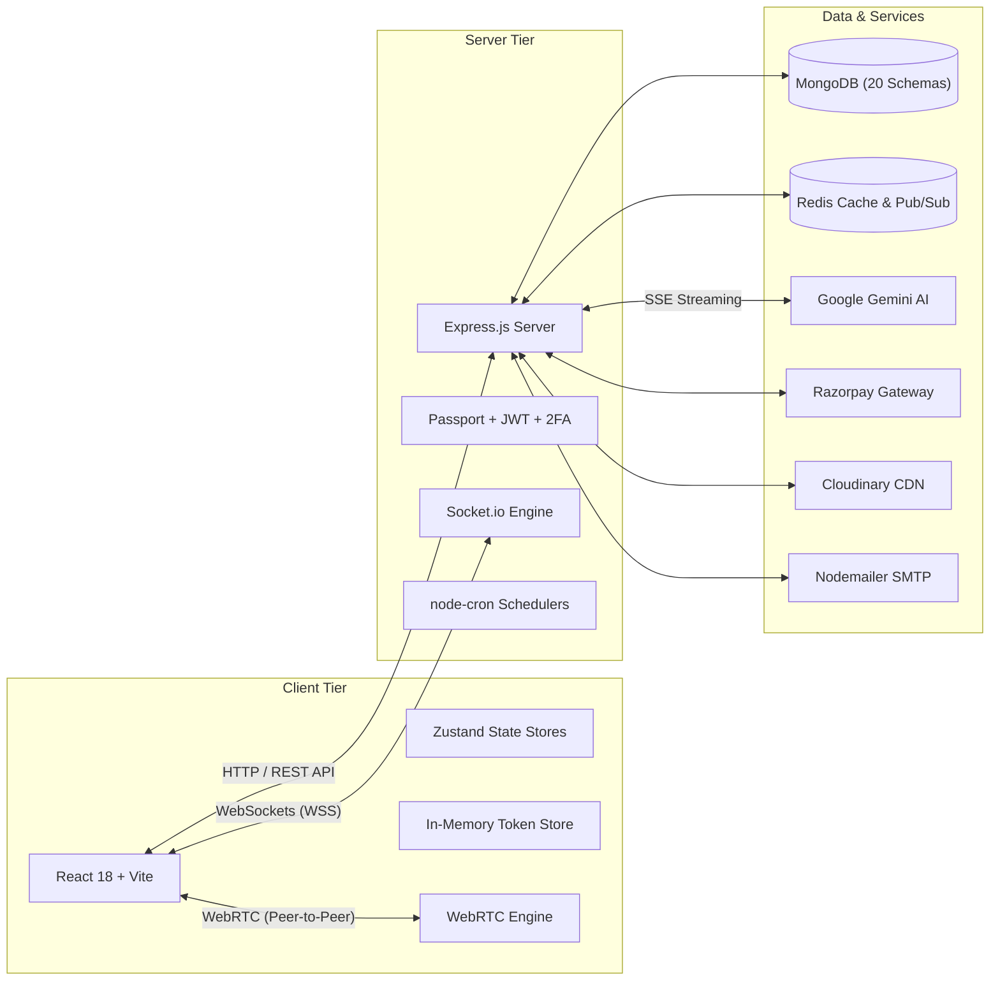
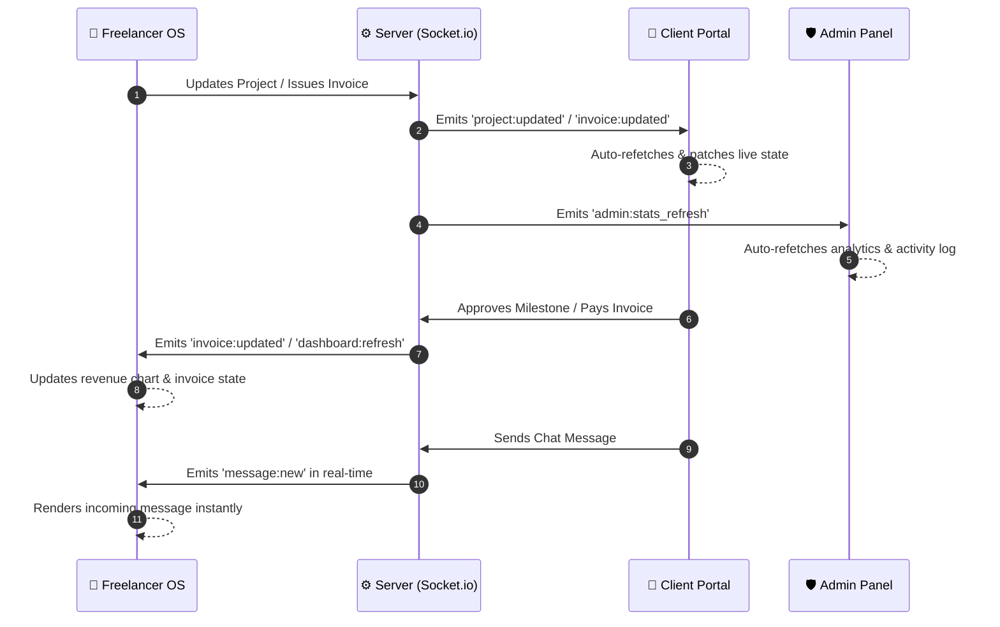

<div align="center">

# ⚡ Skillora — Freelancer OS & Client Portal

### *A Production-Grade, Full-Stack Freelancing Ecosystem*

Manage projects, tasks, clients, invoices, payments, escrow, disputes, proposals, meetings, real-time chat, file uploads, and AI-powered productivity — all in one unified platform.

<br/>

[](.)
[](.)
[](.)
[](.)
[](.)
[](.)
[](.)
[](.)

<br/>

[📖 Overview](#-what-is-skillora) · [🌟 Features](#-key-features) · [🖥 Portals](#-the-3-portals-at-a-glance) · [🏗 Architecture](#-system-architecture) · [🔒 Security](#-security-architecture) · [🗄 Database](#-database-schemas-20-models) · [🛠 Tech Stack](#-tech-stack) · [🚀 Quick Start](#-quick-start) · [🔌 API Reference](#-complete-api-reference) · [📁 Structure](#-project-structure) · [❓ FAQ](#-faq)

</div>

---

## 📖 What is Skillora?

**Skillora** is a full-stack freelancing platform that unifies freelancer workflows, client collaboration, marketplace hiring, and admin oversight into a single high-performance application.

Instead of juggling multiple SaaS tools for project tracking, task management, client communication, invoicing, payment processing, and AI assistance — Skillora integrates everything into **one synchronized workspace** with real-time updates across all user roles.

> 💡 **Why Skillora?** — Three role-based portals (Freelancer, Client, Admin), Razorpay-powered payments with escrow protection, WebRTC video meetings, marketplace with proposal workflows, AI-powered productivity tools, and 2FA security — all self-hosted and fully customizable.

---

## 🌟 Key Features

### 💼 Freelancer OS
- **Kanban Task Boards** — Drag-and-drop (`@dnd-kit`) with priority levels, checklists, and position reordering
- **Project Management** — Budgets, deadlines, milestones, progress tracking, and AI-generated task suggestions
- **Client CRM** — Contact management, company profiles, billing addresses, and revenue statistics
- **Invoice Builder** — Sequential numbering (`INV-2026-0001`), line items, tax calculation, status lifecycle (`Draft → Sent → Viewed → Paid → Overdue`), and PDF export
- **Skill Portfolio Matrix** — Categorized skills with auto-calculated proficiency levels (Beginner → Expert)
- **AI Studio** — Google Gemini–powered project planning, proposal drafting, pricing suggestions, and productivity insights with SSE streaming
- **Marketplace** — Post projects for hiring, browse proposals, and accept freelancers

### 👥 Client Portal
- **Project Oversight** — Real-time completion percentages, task statuses, and milestone tracking
- **Proposal Management** — Post projects, receive proposals, accept/reject freelancers
- **Invoice Review & Payments** — View detailed invoices and pay online via Razorpay integration
- **Milestone Approvals** — Approve deliverables or request changes on milestone submissions
- **Finance Dashboard** — Spending summaries, revenue analytics, and AI-powered financial insights
- **Real-Time Messaging** — Project-scoped chat threads with file attachments via Socket.io
- **CSV Export** — One-click export of projects and invoices data

### 🛡 Admin Command Center
- **Platform Analytics** — Total users, active projects, processed volume, and real-time activity
- **User Management** — Search, filter by role, update statuses, assign roles, and export to CSV
- **Revenue Dashboard** — Revenue charts, summaries, and trend analysis
- **Dispute Resolution** — Review and resolve platform disputes between freelancers and clients
- **Platform Configuration** — MongoDB-persisted settings for maintenance mode, registration toggles, and support contacts
- **Audit Log** — System event tracking for registrations, role changes, and admin actions

### ⚡ Cross-Platform Features
- **Razorpay Payments** — Order creation, signature verification, and automated invoice status updates
- **Escrow System** — Deposit, release, and refund funds with project-level escrow tracking
- **Email Notifications** — Transactional emails via Nodemailer (invoices, invitations, password resets, meeting reminders)
- **File Uploads** — Cloudinary-backed avatar and project file uploads
- **WebRTC Video Meetings** — Schedule meetings, video calls with call history logging
- **Real-Time Sync** — Socket.io bi-directional updates across all active sessions
- **Two-Factor Auth** — TOTP-based 2FA setup, enable, disable, and login verification
- **Review System** — User and project-level reviews and ratings

---

## 🖥 The 3 Portals at a Glance

```mermaid
graph TD
    A["⚡ Skillora Platform"] --> B["💼 Freelancer OS"]
    A --> C["👥 Client Portal"]
    A --> D["🛡 Admin Command Center"]

    B --> B1["Projects, Tasks & Kanban Board"]
    B --> B2["Client CRM & Revenue Analytics"]
    B --> B3["Line-Item Invoices & PDF Export"]
    B --> B4["AI Studio — Plans, Proposals, Pricing"]
    B --> B5["Marketplace & Proposal Bidding"]
    B --> B6["Escrow & Payment Management"]
    B --> B7["Video Meetings via WebRTC"]

    C --> C1["Project Overview & Milestone Tracking"]
    C --> C2["Post Projects & Manage Proposals"]
    C --> C3["Invoice Review & Razorpay Payments"]
    C --> C4["Finance Summary & AI Insights"]
    C --> C5["Real-Time Project Chat"]
    C --> C6["Notification Center"]

    D --> D1["Platform Stats & Revenue Charts"]
    D --> D2["User Control & Role Management"]
    D --> D3["Dispute Resolution Center"]
    D --> D4["MongoDB Platform Config"]
    D --> D5["System Audit Log"]
```



### 1. 💼 Freelancer OS (`/dashboard`)

| Feature | Details |
| :--- | :--- |
| **Kanban Board** | Drag-and-drop tasks with `@dnd-kit`, priority levels, checklists, and column reordering |
| **Project Management** | CRUD with budgets, deadlines, milestones, progress %, and AI-suggested task breakdowns |
| **Client CRM** | Contact records, company billing profiles, revenue stats, and portal invitation system |
| **Invoicing** | Sequential numbering, line-item builder, tax, status lifecycle, send/duplicate/PDF export |
| **Payments** | Razorpay integration, escrow deposits/releases/refunds, earnings summary |
| **AI Studio** | Gemini-powered chat, project planning, proposal drafting, pricing, and productivity analysis |
| **Marketplace** | Browse open projects, submit proposals, and track proposal statuses |
| **Meetings** | Schedule video meetings, WebRTC calls, and view call history |
| **Skills** | Categorized skill matrix with proficiency scoring (1–100) |

### 2. 👥 Client Portal (`/client/dashboard`)

| Feature | Details |
| :--- | :--- |
| **Dashboard** | Overview with spending summary, project statuses, and recent activity |
| **Projects** | Post projects, browse proposals, accept/reject freelancers, and track progress |
| **Invoices** | View issued invoices, line-item details, and pay via Razorpay |
| **Milestones** | Approve deliverables or request changes on submissions |
| **Finance** | Spending analytics, revenue breakdowns, and AI-powered financial insights |
| **Messages** | Project-scoped real-time chat with file attachments |
| **Notifications** | Bell notifications with unread counts and mark-all-read |

### 3. 🛡 Admin Command Center (`/admin`)

| Feature | Details |
| :--- | :--- |
| **Analytics** | Platform-wide user counts, project counts, and volume metrics |
| **Users** | Search/filter by role, update status, modify roles, delete accounts, and CSV export |
| **Revenue** | Revenue charts, summaries, and trend analysis |
| **Disputes** | Review, resolve, and manage platform disputes |
| **Config** | MongoDB-persisted settings: maintenance mode, registration, support contacts |
| **Activity Log** | Audit trail of all platform events |

---

## 🏗 System Architecture

### High-Level Overview



### Real-Time Socket.io Event Flow

All 3 portals stay synchronized in real-time via Socket.io event dispatches:



---

## 🔒 Security Architecture

| Layer | Implementation |
| :--- | :--- |
| **Access Tokens** | JWTs stored strictly in JavaScript memory (`tokenStore.js`) — never in `localStorage` or `sessionStorage` |
| **Refresh Tokens** | Stored in `HttpOnly`, `SameSite=Strict` secure cookies for silent token rotation |
| **Two-Factor Auth** | TOTP-based 2FA via `speakeasy` + `otplib` with QR code setup (`qrcode`) |
| **OAuth 2.0** | Google and GitHub social login via Passport.js strategies |
| **NoSQL Injection** | All requests sanitized through `express-mongo-sanitize` |
| **XSS Defense** | Payload sanitization via `xss-clean` middleware |
| **Rate Limiting** | Dedicated rate limiters on auth routes (`/api/auth/*`) and AI endpoints |
| **HTTP Headers** | Full Helmet.js suite: CSP, HSTS, X-Frame-Options, referrer policy |
| **Input Validation** | Request validation using Joi schemas |
| **Password Hashing** | bcryptjs with salt rounds |

---

## 🗄 Database Schemas (20 Models)

Skillora uses **20 MongoDB Mongoose models** in `server/models/`:

| # | Model | Collection | Purpose |
| :---: | :--- | :--- | :--- |
| 1 | **User** | `users` | Authentication, roles (`admin`/`freelancer`/`client`), OAuth IDs, 2FA secrets, avatar |
| 2 | **Project** | `projects` | Title, budget, deadlines, progress %, task counters, milestones, marketplace visibility |
| 3 | **Task** | `tasks` | Status (`todo`/`in_progress`/`review`/`done`), priority, Kanban position, checklists |
| 4 | **Client** | `clients` | Company name, contact, billing address, revenue stats, linked user & portal invitation |
| 5 | **Invoice** | `invoices` | Sequential numbers (`INV-YYYY-XXXX`), line items, subtotal, tax, status lifecycle |
| 6 | **Payment** | `payments` | Transaction amount, method, Razorpay order/payment IDs, status, invoice linkage |
| 7 | **Skill** | `skills` | Title, category, score (1–100), auto-calculated proficiency level |
| 8 | **Notification** | `notifications` | User notifications with 90-day TTL auto-cleanup index |
| 9 | **Message** | `messages` | Project chat messages with attachments, reactions, read receipts |
| 10 | **Conversation** | `conversations` | Chat conversation metadata linking project participants |
| 11 | **AiLog** | `ailogs` | AI prompt/response logs, token usage, latency metrics, 180-day TTL |
| 12 | **Counter** | `counters` | Atomic sequential ID generator for invoice numbers |
| 13 | **Config** | `configs` | Platform settings: maintenance mode, registration, support contacts |
| 14 | **Proposal** | `proposals` | Marketplace proposals: bid amount, cover letter, status, freelancer linkage |
| 15 | **Review** | `reviews` | Ratings and reviews for users and projects |
| 16 | **Submission** | `submissions` | Milestone deliverable submissions with revision tracking |
| 17 | **Dispute** | `disputes` | Dispute records between parties with resolution status |
| 18 | **Escrow** | `escrows` | Escrow deposits, releases, and refunds per project |
| 19 | **Meeting** | `meetings` | Scheduled meetings with project linkage and participant info |
| 20 | **CallLog** | `calllogs` | WebRTC call history with duration and participant records |

---

## 🛠 Tech Stack

### Frontend

| Technology | Purpose |
| :--- | :--- |
| React 18 | UI library with hooks and functional components |
| Vite 5 | Lightning-fast build tool and dev server |
| Tailwind CSS v3 | Utility-first CSS framework |
| Zustand | Lightweight state management (13 stores) |
| Framer Motion | Animations and page transitions |
| @dnd-kit | Drag-and-drop Kanban board |
| Recharts | Data visualization and charts |
| React Router v6 | Client-side routing |
| Socket.io Client | Real-time WebSocket communication |
| Axios | HTTP client with interceptors and token refresh |
| Lucide React | Icon library |
| React Hot Toast | Toast notifications |
| date-fns | Date formatting utilities |

### Backend

| Technology | Purpose |
| :--- | :--- |
| Node.js | JavaScript runtime |
| Express.js | Web framework and REST API |
| Socket.io | Real-time bi-directional events |
| Passport.js | OAuth 2.0 (Google, GitHub) |
| JWT (jsonwebtoken) | Access and refresh token authentication |
| Mongoose | MongoDB ODM (20 schemas) |
| Razorpay SDK | Payment order creation and verification |
| @google/generative-ai | Gemini AI integration with SSE streaming |
| Cloudinary | Image/file upload CDN |
| Nodemailer | Transactional email delivery |
| ioredis | Redis client for caching and pub/sub |
| Joi | Request validation schemas |
| Multer | File upload middleware |
| Helmet | HTTP security headers |
| express-rate-limit | API rate limiting |
| express-mongo-sanitize | NoSQL injection prevention |
| xss-clean | XSS attack prevention |
| bcryptjs | Password hashing |
| speakeasy + otplib | TOTP 2FA generation and verification |
| qrcode | QR code generation for 2FA setup |
| node-cron | Scheduled background tasks |
| Winston | Structured logging |
| Morgan | HTTP request logging |

---

## 🚀 Quick Start

### Prerequisites

- **Node.js** v18.0.0+
- **MongoDB** (local or [MongoDB Atlas](https://www.mongodb.com/atlas))
- **Redis** *(optional — for caching & pub/sub)*
- **Git**

### Step 1 — Clone the Repository

```bash
git clone https://github.com/Aaryan-9784/Skillora.git
cd Skillora
```

### Step 2 — Backend Setup

```bash
cd server
npm install
```

Create `server/.env` by copying the example and filling in your credentials:

```bash
cp .env.example .env
```

<details>
<summary><b>📋 Full Environment Variables Reference</b></summary>
<br/>

```env
# ── Server ──────────────────────────────────────────────────
NODE_ENV=development
PORT=5000
SERVER_URL=http://localhost:5000
CLIENT_URL=http://localhost:5173

# ── MongoDB ─────────────────────────────────────────────────
MONGO_URI=mongodb+srv://<username>:<password>@<cluster>.mongodb.net/<dbname>

# ── JWT Security ────────────────────────────────────────────
JWT_ACCESS_SECRET=your_jwt_access_secret_here        # Min 32 random chars
JWT_REFRESH_SECRET=your_jwt_refresh_secret_here      # Min 32 random chars
JWT_ACCESS_EXPIRES=2h
JWT_REFRESH_EXPIRES=30d

# ── Google OAuth ────────────────────────────────────────────
GOOGLE_CLIENT_ID=your_google_client_id
GOOGLE_CLIENT_SECRET=your_google_client_secret

# ── GitHub OAuth ────────────────────────────────────────────
GITHUB_CLIENT_ID=your_github_client_id
GITHUB_CLIENT_SECRET=your_github_client_secret

# ── Google Gemini AI ────────────────────────────────────────
GEMINI_API_KEY=your_gemini_api_key_here
GEMINI_MODEL=gemini-1.5-flash

# ── Razorpay Payments ──────────────────────────────────────
RAZORPAY_KEY_ID=your_razorpay_key_id
RAZORPAY_KEY_SECRET=your_razorpay_key_secret

# ── Redis (Optional) ───────────────────────────────────────
REDIS_URL=

# ── Cloudinary (File Uploads) ──────────────────────────────
CLOUDINARY_CLOUD_NAME=your_cloudinary_cloud_name
CLOUDINARY_API_KEY=your_cloudinary_api_key
CLOUDINARY_API_SECRET=your_cloudinary_api_secret

# ── Email (Nodemailer) ─────────────────────────────────────
EMAIL_SERVICE=gmail
EMAIL_HOST=smtp.gmail.com
EMAIL_PORT=587
EMAIL_SECURE=false
EMAIL_USER=your_email@gmail.com
EMAIL_PASS=your_email_app_password
EMAIL_FROM=your_email@gmail.com
EMAIL_FROM_NAME=Skillora

# ── Default Admin ──────────────────────────────────────────
ADMIN_EMAIL=admin@example.com
ADMIN_PASSWORD=change_this_admin_password
```

</details>

Start the backend:

```bash
npm run dev
# ✅ Server running at http://localhost:5000
```

### Step 3 — Frontend Setup

Open a **new terminal**:

```bash
cd client
npm install
```

Create `client/.env`:

```env
VITE_API_URL=/api
VITE_SERVER_URL=http://localhost:5000
```

Start the frontend:

```bash
npm run dev
# ✅ Client running at http://localhost:5173
```

Open **http://localhost:5173** in your browser 🚀

---

## 🔌 Complete API Reference

### 🔑 Authentication (`/api/auth`)

| Method | Endpoint | Description | Auth |
| :--- | :--- | :--- | :---: |
| `POST` | `/api/auth/register` | Register a new user (freelancer or client) | ❌ |
| `POST` | `/api/auth/login` | Authenticate and receive refresh token cookie | ❌ |
| `POST` | `/api/auth/refresh` | Issue new access token via refresh cookie | ❌ |
| `POST` | `/api/auth/logout` | Logout and clear authentication cookie | 🔒 |
| `POST` | `/api/auth/logout-all` | Invalidate all active sessions | 🔒 |
| `GET` | `/api/auth/me` | Get currently authenticated user | 🔒 |
| `POST` | `/api/auth/forgot-password` | Send password reset email | ❌ |
| `POST` | `/api/auth/reset-password/:token` | Reset password with token | ❌ |
| `POST` | `/api/auth/2fa/setup` | Generate 2FA secret and QR code | 🔒 |
| `POST` | `/api/auth/2fa/enable` | Enable 2FA after TOTP verification | 🔒 |
| `POST` | `/api/auth/2fa/disable` | Disable 2FA | 🔒 |
| `POST` | `/api/auth/2fa/verify-login` | Verify 2FA token during login | ❌ |
| `GET` | `/api/auth/google` | Initiate Google OAuth 2.0 flow | ❌ |
| `GET` | `/api/auth/github` | Initiate GitHub OAuth 2.0 flow | ❌ |

### 📂 Projects (`/api/projects`)

| Method | Endpoint | Description | Auth |
| :--- | :--- | :--- | :---: |
| `GET` | `/api/projects` | List user's projects | 🔒 |
| `POST` | `/api/projects` | Create a new project | 🔒 |
| `GET` | `/api/projects/stats` | Get project statistics | 🔒 |
| `GET` | `/api/projects/:id` | Get project details | 🔒 |
| `PATCH` | `/api/projects/:id` | Update project | 🔒 |
| `DELETE` | `/api/projects/:id` | Delete project | 🔒 |
| `GET` | `/api/projects/:id/tasks` | Get tasks for a project | 🔒 |
| `POST` | `/api/projects/:id/tasks/reorder` | Reorder tasks (Kanban) | 🔒 |
| `GET` | `/api/projects/:id/ai-tasks` | AI-generated task suggestions | 🔒 |
| `POST` | `/api/projects/tasks` | Create a task | 🔒 |
| `PATCH` | `/api/projects/tasks/:id` | Update a task | 🔒 |
| `DELETE` | `/api/projects/tasks/:id` | Delete a task | 🔒 |

### 🏪 Marketplace & Proposals (`/api/projects`)

| Method | Endpoint | Description | Auth |
| :--- | :--- | :--- | :---: |
| `GET` | `/api/projects/explore` | Browse open marketplace projects | 🔒 |
| `POST` | `/api/projects/:projectId/proposals` | Submit a proposal | 🔒 |
| `GET` | `/api/projects/proposals/my` | Get freelancer's own proposals | 🔒 |

### 💰 Invoices (`/api/invoices`)

| Method | Endpoint | Description | Auth |
| :--- | :--- | :--- | :---: |
| `GET` | `/api/invoices` | List invoices | 🔒 |
| `POST` | `/api/invoices` | Create invoice | 🔒 |
| `GET` | `/api/invoices/analytics` | Revenue analytics | 🔒 |
| `GET` | `/api/invoices/outstanding` | Outstanding balance | 🔒 |
| `GET` | `/api/invoices/:id` | Get invoice details | 🔒 |
| `PATCH` | `/api/invoices/:id` | Update invoice | 🔒 |
| `DELETE` | `/api/invoices/:id` | Delete invoice | 🔒 |
| `PATCH` | `/api/invoices/:id/status` | Update invoice status | 🔒 |
| `POST` | `/api/invoices/:id/send` | Send invoice to client | 🔒 |
| `POST` | `/api/invoices/:id/duplicate` | Duplicate an invoice | 🔒 |

### 💳 Payments (`/api/payments`)

| Method | Endpoint | Description | Auth |
| :--- | :--- | :--- | :---: |
| `POST` | `/api/payments/razorpay/create-order` | Create Razorpay payment order | 🔒 |
| `POST` | `/api/payments/razorpay/verify` | Verify Razorpay payment signature | 🔒 |
| `GET` | `/api/payments/earnings` | Get earnings summary | 🔒 |
| `GET` | `/api/payments` | List payments | 🔒 |
| `POST` | `/api/payments` | Record a payment | 🔒 |
| `GET` | `/api/payments/:id` | Get payment details | 🔒 |
| `PATCH` | `/api/payments/:id` | Update payment | 🔒 |

### 🔐 Escrow (`/api/escrow`)

| Method | Endpoint | Description | Auth |
| :--- | :--- | :--- | :---: |
| `POST` | `/api/escrow/deposit` | Deposit funds into escrow | 🔒 |
| `POST` | `/api/escrow/:escrowId/release` | Release escrow to freelancer | 🔒 |
| `POST` | `/api/escrow/:escrowId/refund` | Refund escrow to client | 🔒 |
| `GET` | `/api/escrow/project/:projectId` | Get project escrow details | 🔒 |

### 👥 Clients (`/api/clients`)

| Method | Endpoint | Description | Auth |
| :--- | :--- | :--- | :---: |
| `GET` | `/api/clients` | List freelancer's clients | 🔒 |
| `POST` | `/api/clients` | Create a client | 🔒 |
| `GET` | `/api/clients/revenue-stats` | Get client revenue stats | 🔒 |
| `GET` | `/api/clients/:id` | Get client details | 🔒 |
| `PATCH` | `/api/clients/:id` | Update client | 🔒 |
| `DELETE` | `/api/clients/:id` | Delete client | 🔒 |
| `POST` | `/api/clients/:id/invite` | Invite client to portal | 🔒 Freelancer |

### 🌐 Client Portal (`/api/client-portal`)

| Method | Endpoint | Description | Auth |
| :--- | :--- | :--- | :---: |
| `POST` | `/api/client-portal/login` | Client portal login | ❌ |
| `POST` | `/api/client-portal/accept-invite` | Accept portal invitation | ❌ |
| `GET` | `/api/client-portal/me` | Get portal session | 🔒 Client |
| `GET` | `/api/client-portal/profile` | Get client profile | 🔒 Client |
| `PATCH` | `/api/client-portal/profile` | Update client profile | 🔒 Client |
| `GET` | `/api/client-portal/finance-summary` | Finance overview | 🔒 Client |
| `GET` | `/api/client-portal/revenue-analytics` | Revenue analytics | 🔒 Client |
| `GET` | `/api/client-portal/ai-insights` | AI financial insights | 🔒 Client |
| `GET` | `/api/client-portal/projects` | List client's projects | 🔒 Client |
| `POST` | `/api/client-portal/projects` | Post a new project | 🔒 Client |
| `DELETE` | `/api/client-portal/projects/:id` | Delete a project | 🔒 Client |
| `GET` | `/api/client-portal/projects/:projectId/proposals` | View proposals | 🔒 Client |
| `PATCH` | `/api/client-portal/proposals/:proposalId/respond` | Accept/reject proposal | 🔒 Client |
| `GET` | `/api/client-portal/invoices` | List invoices | 🔒 Client |
| `GET` | `/api/client-portal/invoices/:id` | Invoice details | 🔒 Client |
| `POST` | `/api/client-portal/invoices/:id/pay` | Initiate Razorpay payment | 🔒 Client |
| `POST` | `/api/client-portal/invoices/:id/pay/verify` | Verify payment | 🔒 Client |
| `POST` | `/api/client-portal/projects/:id/milestones/:milestoneId/approve` | Approve milestone | 🔒 Client |
| `POST` | `/api/client-portal/projects/:id/milestones/:milestoneId/request-changes` | Request changes | 🔒 Client |
| `GET` | `/api/client-portal/messages/:projectId` | Get project messages | 🔒 Client |
| `POST` | `/api/client-portal/messages/:projectId` | Send message | 🔒 Client |
| `GET` | `/api/client-portal/activity` | Client activity log | 🔒 Client |
| `GET` | `/api/client-portal/notifications` | Get notifications | 🔒 Client |
| `GET` | `/api/client-portal/notifications/unread-count` | Unread count | 🔒 Client |
| `PATCH` | `/api/client-portal/notifications/read-all` | Mark all read | 🔒 Client |
| `PATCH` | `/api/client-portal/notifications/:id/read` | Mark one read | 🔒 Client |

### 🛡 Admin (`/api/admin`)

| Method | Endpoint | Description | Auth |
| :--- | :--- | :--- | :---: |
| `GET` | `/api/admin/stats` | Platform analytics | 🔒 Admin |
| `GET` | `/api/admin/users` | List/search/filter users | 🔒 Admin |
| `PATCH` | `/api/admin/users/:id` | Update user status/role | 🔒 Admin |
| `DELETE` | `/api/admin/users/:id` | Delete user account | 🔒 Admin |
| `GET` | `/api/admin/revenue` | Revenue chart data | 🔒 Admin |
| `GET` | `/api/admin/revenue/summary` | Revenue summary | 🔒 Admin |
| `GET` | `/api/admin/config` | Get platform configuration | 🔒 Admin |
| `PATCH` | `/api/admin/config` | Update platform settings | 🔒 Admin |
| `GET` | `/api/admin/activity` | Platform activity logs | 🔒 Admin |

### 🤖 AI Studio (`/api/ai`)

| Method | Endpoint | Description | Auth |
| :--- | :--- | :--- | :---: |
| `POST` | `/api/ai/chat` | Gemini chat with SSE streaming | 🔒 |
| `POST` | `/api/ai/project-plan` | Generate project breakdown | 🔒 |
| `POST` | `/api/ai/proposal` | Draft a proposal | 🔒 |
| `GET` | `/api/ai/productivity` | Productivity analysis | 🔒 |
| `POST` | `/api/ai/pricing` | Pricing suggestions | 🔒 |
| `GET` | `/api/ai/history` | AI conversation history | 🔒 |
| `POST` | `/api/ai/feedback/:logId` | Rate AI response | 🔒 |

### 💬 Chat (`/api/chat`)

| Method | Endpoint | Description | Auth |
| :--- | :--- | :--- | :---: |
| `GET` | `/api/chat/project` | Get project conversation | 🔒 |
| `GET` | `/api/chat/project/:projectId` | Get specific project conversation | 🔒 |
| `GET` | `/api/chat/conversations/:conversationId/messages` | Get messages | 🔒 |
| `POST` | `/api/chat/conversations/:conversationId/messages` | Send message | 🔒 |
| `DELETE` | `/api/chat/messages/:messageId` | Delete message | 🔒 |
| `POST` | `/api/chat/messages/:messageId/react` | Toggle reaction | 🔒 |
| `POST` | `/api/chat/upload` | Upload chat attachment | 🔒 |

### ⚖️ Disputes (`/api/disputes`)

| Method | Endpoint | Description | Auth |
| :--- | :--- | :--- | :---: |
| `POST` | `/api/disputes` | Create a dispute | 🔒 |
| `GET` | `/api/disputes` | List all disputes | 🔒 Admin |
| `PATCH` | `/api/disputes/:disputeId/resolve` | Resolve dispute | 🔒 Admin |

### 📋 Submissions (`/api/submissions`)

| Method | Endpoint | Description | Auth |
| :--- | :--- | :--- | :---: |
| `POST` | `/api/submissions` | Create submission | 🔒 |
| `PATCH` | `/api/submissions/:submissionId/revision` | Request revision | 🔒 |
| `PATCH` | `/api/submissions/:submissionId/approve` | Approve submission | 🔒 |
| `GET` | `/api/submissions/project/:projectId` | Get project submissions | 🔒 |

### ⭐ Reviews (`/api/reviews`)

| Method | Endpoint | Description | Auth |
| :--- | :--- | :--- | :---: |
| `POST` | `/api/reviews` | Create review | 🔒 |
| `GET` | `/api/reviews/user/:userId` | Get user reviews | ❌ |
| `GET` | `/api/reviews/project/:projectId` | Get project reviews | ❌ |

### 📹 Meetings (`/api/meetings`)

| Method | Endpoint | Description | Auth |
| :--- | :--- | :--- | :---: |
| `POST` | `/api/meetings/schedule` | Schedule a meeting | 🔒 |
| `GET` | `/api/meetings/project/:projectId` | Get project meetings | 🔒 |
| `GET` | `/api/meetings/calls/history` | Call history | 🔒 |

### 🔧 Other Endpoints

| Method | Endpoint | Description | Auth |
| :--- | :--- | :--- | :---: |
| `GET` | `/api/dashboard` | Freelancer dashboard summary | 🔒 |
| `GET` | `/api/billing` | Billing info | 🔒 |
| `GET` | `/api/users/freelancers` | List freelancers | ❌ |
| `GET` | `/api/users/:id` | Get user by ID | ❌ |
| `GET` | `/api/users/profile` | Get own profile | 🔒 |
| `PATCH` | `/api/users/profile` | Update profile | 🔒 |
| `PATCH` | `/api/users/change-password` | Change password | 🔒 |
| `POST` | `/api/upload/avatar` | Upload avatar to Cloudinary | 🔒 |
| `POST` | `/api/upload/file` | Upload project file | 🔒 |
| `GET` | `/api/skills` | List skills | 🔒 |
| `POST` | `/api/skills` | Create skill | 🔒 |
| `GET` | `/api/skills/by-category` | Skills grouped by category | 🔒 |
| `PATCH` | `/api/skills/:id` | Update skill | 🔒 |
| `DELETE` | `/api/skills/:id` | Delete skill | 🔒 |
| `GET` | `/api/notifications` | Get notifications | 🔒 |
| `GET` | `/api/notifications/unread` | Get unread count | 🔒 |
| `PATCH` | `/api/notifications/read-all` | Mark all as read | 🔒 |
| `PATCH` | `/api/notifications/:id/read` | Mark notification read | 🔒 |
| `DELETE` | `/api/notifications/:id` | Delete notification | 🔒 |

---

## 📁 Project Structure

```
Skillora/
├── client/                            # React 18 + Vite Frontend
│   ├── public/                        # Static assets & favicon
│   └── src/
│       ├── App.jsx                    # Root component with route definitions
│       ├── main.jsx                   # Application entry point
│       ├── components/
│       │   ├── admin/                 # Admin-specific UI components
│       │   ├── ai/                    # AI floating widget, chat studio
│       │   ├── chat/                  # Real-time chat components
│       │   ├── common/                # ProtectedRoute, AdminRoute, ClientRoute
│       │   ├── dashboard/             # Stat cards, revenue charts, activity feeds
│       │   ├── projects/              # Kanban board (@dnd-kit), project cards
│       │   └── ui/                    # Modals, buttons, badges, command palette
│       ├── hooks/
│       │   ├── useAuth.js             # Authentication hook
│       │   ├── useClickOutside.js     # Click outside detector
│       │   ├── useCommandPalette.js   # ⌘K command palette
│       │   ├── useConfirm.js          # Confirmation dialogs
│       │   ├── useDebounce.js         # Input debouncing
│       │   ├── useFetch.js            # Data fetching hook
│       │   ├── useSocket.js           # Socket.io connection
│       │   ├── useSyncEvents.js       # Real-time event synchronization
│       │   └── useWebRTC.js           # WebRTC video call hook
│       ├── layouts/
│       │   ├── AdminLayout.jsx        # Admin portal layout
│       │   ├── ClientLayout.jsx       # Client portal layout
│       │   ├── DashboardLayout.jsx    # Freelancer dashboard layout
│       │   └── MainLayout.jsx         # Public pages layout
│       ├── pages/
│       │   ├── AI/                    # Dedicated AI Chat Studio
│       │   ├── Admin/                 # Admin: Overview, Users, Revenue, Config, Logs
│       │   ├── Auth/                  # Login, Register, Password Reset, OAuth
│       │   ├── ClientPortal/          # Client Dashboard, Projects, Invoices, Chat
│       │   ├── Clients/               # Client CRM list & detail views
│       │   ├── Dashboard/             # Freelancer main overview
│       │   ├── Freelancers/           # Freelancer profiles & marketplace
│       │   ├── Landing/               # Public product landing page
│       │   ├── Marketplace/           # Browse projects & submit proposals
│       │   ├── Messages/              # Real-time messaging center
│       │   ├── Payments/              # Invoices, payments & Razorpay
│       │   ├── Profile/               # User profile & settings
│       │   ├── Projects/              # Project list & detail views
│       │   ├── Skills/                # Technical skill matrix
│       │   └── Tasks/                 # Kanban board view
│       ├── services/
│       │   ├── api.js                 # Axios instance with interceptors
│       │   ├── adminService.js        # Admin API calls
│       │   ├── authService.js         # Auth API calls
│       │   ├── clientPortalService.js # Client portal API calls
│       │   ├── marketplaceService.js  # Marketplace API calls
│       │   ├── razorpayService.js     # Razorpay payment integration
│       │   ├── socketService.js       # Socket.io client setup
│       │   └── tokenStore.js          # In-memory JWT token store
│       ├── store/                     # 13 Zustand state stores
│       ├── styles/                    # Global CSS and Tailwind config
│       └── utils/
│           ├── constants.js           # App-wide constants
│           ├── helpers.js             # Formatters (currency, dates)
│           ├── planConstants.js       # Plan tier definitions
│           └── webrtcConfig.js        # WebRTC ICE server config
│
├── server/                            # Node.js + Express Backend
│   ├── server.js                      # HTTP + Socket.io server bootstrap
│   ├── app.js                         # Express app config & middleware
│   ├── config/
│   │   ├── db.js                      # MongoDB connection with retry logic
│   │   ├── env.js                     # Environment variable validation
│   │   ├── oauth.js                   # OAuth configuration
│   │   ├── passport.js                # Passport strategies (Google, GitHub)
│   │   ├── plans.js                   # Subscription plan definitions
│   │   ├── redis.js                   # Redis client configuration
│   │   └── socket.js                  # Socket.io server configuration
│   ├── controllers/                   # 21 route controllers
│   ├── middlewares/
│   │   ├── auth.middleware.js         # JWT verification, role guards
│   │   ├── error.middleware.js        # Global error handler
│   │   ├── planGate.js                # Plan-based feature gating
│   │   ├── rateLimiter.js             # Rate limiting (auth, AI)
│   │   └── upload.js                  # Multer + Cloudinary config
│   ├── models/                        # 20 Mongoose schemas
│   ├── routes/                        # 20 route modules
│   ├── services/                      # 17 business logic services
│   ├── utils/                         # ApiError, ApiResponse, asyncHandler, logger
│   └── validators/                    # Joi validation schemas
│
├── docs/                              # Documentation
│   └── CHAT_APP_IMPLEMENTATION.md     # Chat feature documentation
├── video/                             # Demo videos
│   ├── Landing Page Video.mp4
│   └── Signup & Login Page Video.mp4
└── README.md
```

---

## ❓ FAQ

<details>
<summary><b>What payment gateway does Skillora use?</b></summary>
<br/>
Skillora integrates with <b>Razorpay</b> for payment processing. The system supports order creation, payment signature verification, and automatic invoice status updates. An escrow system provides additional fund protection for both freelancers and clients.
</details>

<details>
<summary><b>How does real-time sync work across different user roles?</b></summary>
<br/>
Skillora uses <b>Socket.io</b> to broadcast scoped event payloads when data mutations occur. Custom hooks (<code>useSyncEvents.js</code>) intercept server broadcasts and seamlessly update UI state across Freelancer, Client, and Admin sessions without page refreshes.
</details>

<details>
<summary><b>How are access tokens securely stored?</b></summary>
<br/>
Access tokens are kept <b>strictly in JavaScript memory</b> within <code>tokenStore.js</code>. Refresh tokens are stored in secure, <code>HttpOnly</code>, <code>SameSite=Strict</code> cookies. Tokens are never stored in <code>localStorage</code> or <code>sessionStorage</code>, making the app immune to XSS token theft.
</details>

<details>
<summary><b>Does Skillora support Two-Factor Authentication?</b></summary>
<br/>
Yes! Skillora implements <b>TOTP-based 2FA</b> using <code>speakeasy</code> and <code>otplib</code>. Users can scan a QR code with any authenticator app (Google Authenticator, Authy, etc.), then enable 2FA for an additional security layer on every login.
</details>

<details>
<summary><b>Can clients hire freelancers through the platform?</b></summary>
<br/>
Yes. Skillora includes a full <b>marketplace system</b>. Clients can post projects, freelancers can browse open projects and submit proposals with bid amounts and cover letters, and clients can accept or reject proposals — all within the platform.
</details>

<details>
<summary><b>What file upload options are available?</b></summary>
<br/>
Skillora uses <b>Cloudinary</b> for all file storage — including user avatars, project files, and chat attachments. Files are processed through Multer middleware and uploaded to Cloudinary's CDN for fast, reliable delivery.
</details>

---

## 📜 License

Distributed under the **MIT License**. See `LICENSE` for more information.

---

<div align="center">

**Built with ❤️ by [Aaryan](https://github.com/Aaryan-9784)**

**Skillora — The Complete Freelancing Ecosystem ⚡**

</div>
