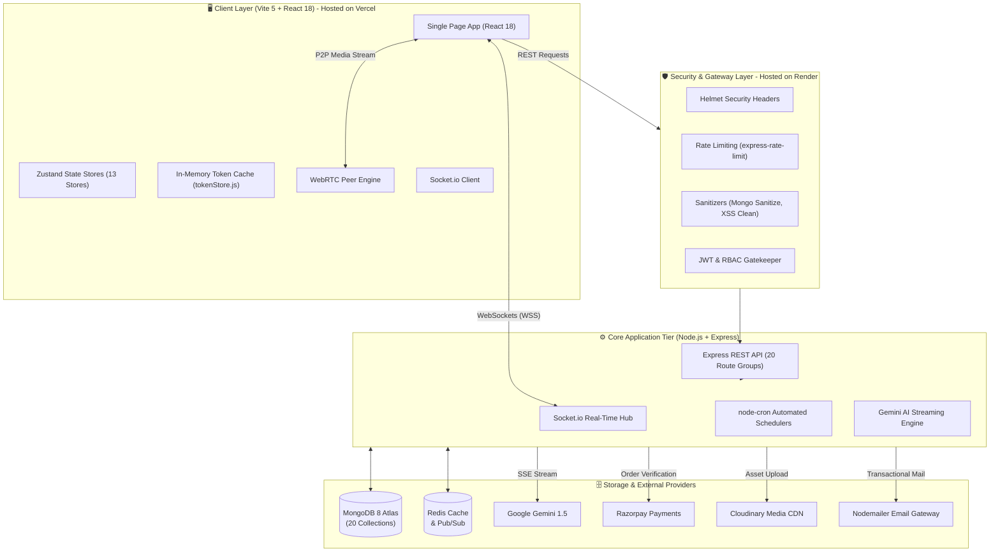
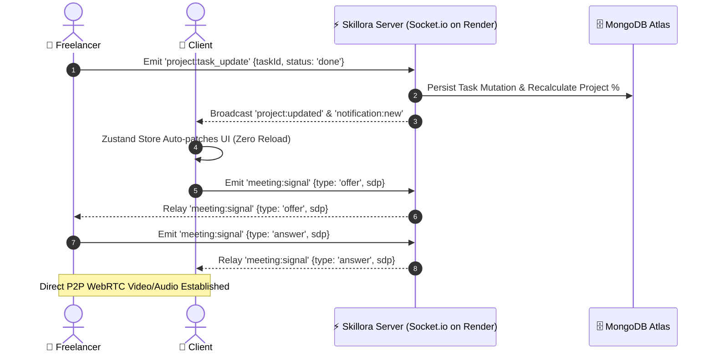
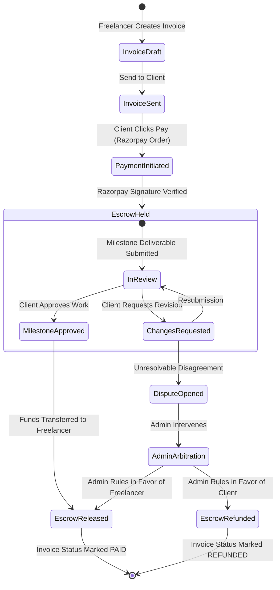

<div align="center">

# ⚡ Skillora
### Enterprise-Grade Freelancer Operating System, Client Collaboration Portal & Marketplace

[](https://skillora-gamma.vercel.app)
[](https://skillora-hyf8.onrender.com)
[](https://skillora-gamma.vercel.app)
[](https://github.com/Aaryan-9784/Skillora/releases)
[](LICENSE)

<br/>

[](https://react.dev/)
[](https://expressjs.com/)
[](https://www.mongodb.com/)
[](https://socket.io/)
[](https://ai.google.dev/)
[](https://razorpay.com/)
[](https://tailwindcss.com/)

<br/>

<p align="center">
  <b>Skillora</b> is a next-generation SaaS ecosystem that unifies project execution, client lifecycle management, milestone escrow payments, peer-to-peer WebRTC video collaboration, and generative AI copilot assistance into a single, high-performance platform.
</p>

<p align="center">
  <a href="https://skillora-gamma.vercel.app" target="_blank"><strong>🚀 Launch Live Web App</strong></a> •
  <a href="https://skillora-hyf8.onrender.com" target="_blank"><strong>⚡ Backend API Gateway</strong></a> •
  <a href="https://skillora-hyf8.onrender.com/health" target="_blank"><strong>📡 API Health Check</strong></a> •
  <a href="#-system-architecture"><strong>Architecture</strong></a> •
  <a href="#-key-features"><strong>Features</strong></a> •
  <a href="#-complete-api-reference"><strong>API Reference</strong></a> •
  <a href="#-quick-start--local-setup"><strong>Quick Start</strong></a>
</p>

</div>

---

## 🌐 Live Deployments & Cloud Infrastructure

Skillora is fully deployed on production cloud infrastructure with continuous deployment pipelines:

```
┌─────────────────────────────────────────────────────────────────────────────┐
│                             LIVE CLOUD SERVICES                             │
├───────────────────────────────────┬─────────────────────────────────────────┤
│  🖥 FRONTEND WEB APP (Vercel)     │  ⚙️ BACKEND API GATEWAY (Render)        │
│  👉 https://skillora-gamma.vercel.app │  👉 https://skillora-hyf8.onrender.com │
│  • Interactive React 18 UI        │  • Express REST API (20 Route Groups)   │
│  • Client & Freelancer Portals    │  • Socket.io & WebRTC Signaling Hub     │
│  • Admin Command Center           │  • Automated Cron Job Schedulers        │
└───────────────────────────────────┴─────────────────────────────────────────┘
```

### Deployment Topology Details

| Component | Cloud Host | Production URL | Status | Responsibilities |
| :--- | :--- | :--- | :---: | :--- |
| **Frontend Web App** | **Vercel** | [https://skillora-gamma.vercel.app](https://skillora-gamma.vercel.app) |  | Production Single Page Application (React 18, Vite 5, Tailwind CSS, Zustand) |
| **Backend API Gateway** | **Render** | [https://skillora-hyf8.onrender.com](https://skillora-hyf8.onrender.com) |  | Core Node.js/Express server, Authentication, WebSockets & Background Workers |
| **Health Telemetry** | **Render** | [https://skillora-hyf8.onrender.com/health](https://skillora-hyf8.onrender.com/health) |  | Real-time service uptime, cluster environment, and timestamp ping |
| **Deployment Preview** | **Vercel** | [https://skillora-kjvtvxfrq-aryan-e7c5.vercel.app](https://skillora-kjvtvxfrq-aryan-e7c5.vercel.app) |  | Staging build for continuous integration testing |

> [!TIP]
> **Trying the Live Demo**:
> 1. Visit the **[Live Web App](https://skillora-gamma.vercel.app)**.
> 2. Click **Get Started** or **Sign In** to register as either a **Freelancer** or a **Client**.
> 3. Explore interactive Kanban boards, generate AI project scopes with Gemini, test WebRTC video calling, or test invoice generation with Razorpay escrow flows.

---

## 📑 Table of Contents

- [Live Deployments & Cloud Infrastructure](#-live-deployments--cloud-infrastructure)
- [Executive Overview](#-executive-overview)
- [Key Features](#-key-features)
  - [1. Freelancer OS (`/dashboard`)](#1--freelancer-os-dashboard)
  - [2. Client Portal (`/client/dashboard`)](#2--client-portal-clientdashboard)
  - [3. Admin Command Center (`/admin`)](#3--admin-command-center-admin)
  - [4. Cross-Cutting Capabilities](#4--cross-cutting-capabilities)
- [System Architecture](#-system-architecture)
  - [High-Level Topology](#high-level-topology)
  - [Real-Time Event & WebRTC Signaling Flow](#real-time-event--webrtc-signaling-flow)
  - [Payment & Escrow State Machine](#payment--escrow-state-machine)
- [Security & Compliance Posture](#-security--compliance-posture)
- [Database Topology (20 Schemas)](#-database-topology-20-schemas)
- [Tech Stack](#-tech-stack)
- [Quick Start & Local Setup](#-quick-start--local-setup)
  - [Prerequisites](#prerequisites)
  - [Step 1: Clone Repository](#step-1--clone-repository)
  - [Step 2: Backend Setup & Environment](#step-2--backend-setup--environment)
  - [Step 3: Frontend Setup & Environment](#step-3--frontend-setup--environment)
  - [Step 4: Seed Default Admin User](#step-4--seed-default-admin-user)
- [Environment Variables Reference](#-environment-variables-reference)
- [Complete API Reference](#-complete-api-reference)
- [Socket.io Real-Time Event Matrix](#-socketio-real-time-event-matrix)
- [Production Deployment](#-production-deployment)
  - [Frontend: Vercel](#frontend-vercel)
  - [Backend: Render / Docker](#backend-render--docker)
  - [Production Checklist](#production-checklist)
- [Project Directory Structure](#-project-directory-structure)
- [Testing & Quality Assurance](#-testing--quality-assurance)
- [Contributing Guidelines](#-contributing-guidelines)
- [Security Policy](#-security-policy)
- [License & Authors](#-license--authors)

---

## 💼 Executive Overview

Traditional freelancer workflows require stitching together disjointed point solutions — Trello for tasks, Freshbooks for billing, Slack for client communication, Zoom for calls, Upwork for bidding, and ChatGPT for copywriting. 

**Skillora solves this fragmentation** by delivering an enterprise-ready, three-tier collaborative workspace designed from the ground up for freelancers, high-value clients, and platform operators.

```
┌──────────────────────────────────────────────────────────────────────────┐
│                             SKILLORA PLATFORM                            │
├──────────────────────┬──────────────────────┬────────────────────────────┤
│   💼 FREELANCER OS   │   👥 CLIENT PORTAL   │   🛡 ADMIN COMMAND CENTER  │
│  • Kanban Task Engine│  • Milestone Approvals│  • Platform Analytics      │
│  • AI Project Studio │  • Razorpay Checkout │  • Dispute Arbitration     │
│  • Invoice Generator │  • Proposal Review   │  • System Audit Logging    │
│  • Escrow Tracking   │  • Finance Insights  │  • Tenant & User Controls  │
│  • WebRTC Video Call │  • Real-Time Chat    │  • Dynamic Configuration   │
└──────────────────────┴──────────────────────┴────────────────────────────┘
```

---

## 🌟 Key Features

### 1. 💼 Freelancer OS (`/dashboard`)
- **Interactive Kanban Boards**: Drag-and-drop task workflows powered by `@dnd-kit` with priority weights, sub-task checklists, and position indexing.
- **Project Lifecycle Tracking**: Real-time progress computation, budget burn-down meters, milestone delivery dates, and deliverable attachments.
- **Client CRM Engine**: Centralized client registry, billing profiles, total lifetime revenue metrics, and direct client portal onboarding invitations.
- **Enterprise Invoicing**: Sequential number generator (`INV-YYYY-XXXX`), tax computations, automated balance tracking, status progression (`Draft` → `Sent` → `Viewed` → `Paid` → `Overdue`), and one-click PDF export.
- **AI Copilot Studio**: SSE-streamed Google Gemini integration providing contextual project scoping, proposal writing, pricing calculators, and productivity telemetry.
- **Marketplace & Proposal Engine**: Explore open customer tenders, submit competitive bids with custom milestones, and monitor submission statuses.
- **Integrated Video Conferencing**: Browser-native WebRTC peer-to-peer audio/video conferencing with meeting scheduler and call logs.
- **Skill Matrix Visualization**: Dynamic competency scoring with automated proficiency tier badges (Beginner, Intermediate, Advanced, Expert).

### 2. 👥 Client Portal (`/client/dashboard`)
- **Executive Project Oversight**: Live view of active milestones, team completion velocity, and pending deliverables.
- **Marketplace Procurement**: Post job requirements, receive bids from verified freelancers, review candidate profiles, and award contracts.
- **Frictionless Invoice Checkout**: Instant invoice review with integrated Razorpay payment gateway, automated receipts, and payment history.
- **Milestone & Escrow Approvals**: Review milestone deliverables, approve payouts directly into freelancer accounts, or submit revision requests.
- **Financial Intelligence**: Spending dashboards, cost projections, categorized expense graphs, and AI-driven budget optimization advice.
- **Real-Time Project Messaging**: Scoped project channels with file attachment sharing, emoji reactions, read receipts, and live typing indicators.

### 3. 🛡 Admin Command Center (`/admin`)
- **Telemetry & Revenue Analytics**: Platform-wide transaction volumes, escrow deposits, active user trends, and revenue growth charts.
- **User Governance**: Multi-factor search, role overrides (`admin`, `freelancer`, `client`), account status locks (`active`, `suspended`), and CSV data exports.
- **Dispute Resolution Engine**: Multi-party dispute investigation with evidence inspection, escrow release overrides, and arbitration logging.
- **System Configuration**: Hot-reloadable platform flags stored in MongoDB (maintenance mode toggles, registration gatekeepers, global support emails).
- **Audit Logging**: Immutable system event trail capturing authentication attempts, administrative interventions, and financial state transitions.

### 4. ⚡ Cross-Cutting Capabilities
- **Zero-Storage Token Security**: In-memory JWT access token store paired with secure `HttpOnly`, `SameSite=Strict` refresh token rotation.
- **Two-Factor Authentication (2FA)**: Time-based One-Time Password (TOTP) enforcement via `speakeasy` + `otplib` with QR code provisioning.
- **Multi-CDN Cloud Storage**: Cloudinary-backed high-speed media delivery for user avatars, project documents, and chat attachments.
- **Automated Transactional Emails**: SMTP notification pipeline via Nodemailer for invoice distribution, invite tokens, password recovery, and call notifications.

---

## 🏗 System Architecture

### High-Level Topology



### Real-Time Event & WebRTC Signaling Flow



### Payment & Escrow State Machine



---

## 🔒 Security & Compliance Posture

Skillora implements an end-to-end Zero-Trust security model across the entire stack:

| Dimension | Defense Mechanism | Implementation File |
| :--- | :--- | :--- |
| **Token Theft Protection** | Access tokens are stored exclusively in **JavaScript runtime memory**; never saved in `localStorage` or `sessionStorage`. | [`tokenStore.js`](file:///d:/Projects/Skillora/client/src/services/tokenStore.js) |
| **Silent Session Rotation** | Refresh tokens reside inside encrypted, `HttpOnly`, `SameSite=Strict`, `Secure` cookies. | [`auth.controller.js`](file:///d:/Projects/Skillora/server/controllers/auth.controller.js) |
| **Multi-Factor Auth (2FA)** | Time-based OTP (TOTP) verification using standard RFC 6238 algorithms with recovery workflows. | [`auth.routes.js`](file:///d:/Projects/Skillora/server/routes/auth.routes.js) |
| **NoSQL Injection Defense** | Sanitizes user-supplied query operators from MongoDB parameters. | `express-mongo-sanitize` |
| **Cross-Site Scripting (XSS)** | Sanitizes inbound payloads to strip malicious HTML/JavaScript tags. | `xss-clean` |
| **Denial of Service (DoS)** | Tiered rate limiters applied to authentication endpoints and AI generation routes. | [`rateLimiter.js`](file:///d:/Projects/Skillora/server/middlewares/rateLimiter.js) |
| **HTTP Hardening** | Enforces Content Security Policy (CSP), Strict-Transport-Security (HSTS), and Frameguard. | `helmet` |
| **Schema Validation** | Strict Joi request body validation preventing payload tampering and prototype pollution. | [`validators/`](file:///d:/Projects/Skillora/server/validators) |

---

## 🗄 Database Topology (20 Schemas)

Skillora utilizes 20 relational-modeled MongoDB schemas powered by Mongoose:

| # | Model | Collection | Primary Domain & Responsibilities | Key Indexes |
| :-: | :--- | :--- | :--- | :--- |
| **01** | `User` | `users` | Identities, bcrypt passwords, roles (`admin`, `freelancer`, `client`), 2FA secrets, avatars | `email`, `role`, `status` |
| **02** | `Project` | `projects` | Budget, deadlines, status, completion %, milestone lists, marketplace flags | `freelancer`, `client`, `status` |
| **03** | `Task` | `tasks` | Kanban cards, status (`todo`, `in_progress`, `review`, `done`), priority, position | `project`, `status`, `position` |
| **04** | `Client` | `clients` | Company records, tax IDs, billing details, portal invite status, lifetime spend | `freelancer`, `email` |
| **05** | `Invoice` | `invoices` | Sequential numbering (`INV-YYYY-XXXX`), line items, subtotal, tax, status, PDF | `invoiceNumber`, `project`, `client` |
| **06** | `Payment` | `payments` | Razorpay payment/order IDs, transaction signatures, settlement status | `invoice`, `transactionId`, `status` |
| **07** | `Skill` | `skills` | Skill taxonomy, user proficiency scores (1–100), categorization | `user`, `category` |
| **08** | `Notification` | `notifications` | In-app alerts, read states, entity hyperlinks with 90-day automatic TTL | `recipient`, `isRead`, `createdAt (TTL)` |
| **09** | `Message` | `messages` | Chat messages, Cloudinary attachment links, reactions, read receipts | `conversation`, `sender`, `createdAt` |
| **10** | `Conversation` | `conversations` | Project-scoped messaging threads linking participants | `project`, `participants` |
| **11** | `AiLog` | `ailogs` | Prompt/response telemetry, token usage, latency logs with 180-day TTL | `user`, `action`, `createdAt (TTL)` |
| **12** | `Counter` | `counters` | Atomic sequential generator for unique invoice numbers | `_id`, `seq` |
| **13** | `Config` | `configs` | Platform-wide operational flags (maintenance, registrations, support contact) | `key` |
| **14** | `Proposal` | `proposals` | Marketplace bids, cover letters, proposed rates, review statuses | `project`, `freelancer`, `status` |
| **15** | `Review` | `reviews` | Star ratings, feedback testimonials for users and completed projects | `targetUser`, `project`, `rating` |
| **16** | `Submission` | `submissions` | Milestone deliverables, file attachments, approval notes, revision cycles | `project`, `milestoneId`, `status` |
| **17** | `Dispute` | `disputes` | Contract conflict cases, dispute claims, mediator rulings | `project`, `initiator`, `status` |
| **18** | `Escrow` | `escrows` | Escrow account balances, deposit locks, release and refund audits | `project`, `client`, `status` |
| **19** | `Meeting` | `meetings` | Scheduled appointments, agenda topics, attendee references | `project`, `host`, `scheduledAt` |
| **20** | `CallLog` | `calllogs` | WebRTC session durations, call status, connection timestamps | `caller`, `receiver`, `startedAt` |

---

## 🛠 Tech Stack

### Core Technologies

```
Frontend:  React 18  •  Vite 5  •  Tailwind CSS 3  •  Zustand  •  Framer Motion  •  @dnd-kit  •  Recharts
Backend:   Node.js   •  Express.js  •  Socket.io 4  •  Passport.js  •  JWT  •  Mongoose 8  •  Joi
Data/AI:   MongoDB Atlas  •  Redis  •  Google Gemini 1.5  •  Razorpay SDK  •  Cloudinary CDN  •  Nodemailer
Hosting:   Vercel (Client SPA)  •  Render (Backend Web Service)  •  MongoDB Atlas (Cloud Cluster)
```

### Frontend Dependencies

| Package | Version | Architectural Responsibility |
| :--- | :--- | :--- |
| `react` / `react-dom` | `^18.2.0` | Component view layer with concurrent rendering |
| `vite` | `^5.0.8` | Next-generation frontend tooling and HMR dev server |
| `tailwindcss` | `^3.4.0` | Design system tokens and responsive utility styling |
| `zustand` | `^4.4.7` | High-performance, lightweight state stores (13 global stores) |
| `framer-motion` | `^11.0.3` | Fluid UI transitions, modal animations, and layout morphing |
| `@dnd-kit/core` & `sortable` | `^6.1.0` / `^8.0.0` | Accessible drag-and-drop Kanban task orchestration |
| `recharts` | `^2.10.3` | Responsive analytics, earnings charts, and revenue visualizations |
| `socket.io-client` | `^4.8.3` | Bi-directional WebSocket communication client |
| `axios` | `^1.6.2` | REST client configured with automatic JWT refresh interceptors |
| `lucide-react` | `^0.303.0` | Consistent iconography suite |

### Backend Dependencies

| Package | Version | Architectural Responsibility |
| :--- | :--- | :--- |
| `express` | `^4.18.2` | Scalable Node.js HTTP web application server |
| `mongoose` | `^8.0.3` | Schema validation and MongoDB Object Data Modeling (ODM) |
| `socket.io` | `^4.6.2` | Real-time WebSocket server and room broadcast coordinator |
| `@google/generative-ai` | `^0.3.1` | Google Gemini 1.5 Flash client with SSE streaming |
| `razorpay` | `^2.9.2` | Commercial payment processing and webhook signature verification |
| `jsonwebtoken` / `bcryptjs` | `^9.0.2` / `^2.4.3` | Stateless token issuance, cryptographic verification, and password hashing |
| `speakeasy` / `otplib` / `qrcode` | `^2.0.0` / `^13.4.1` | RFC 6238 TOTP two-factor authentication setup and verification |
| `passport` & OAuth strategies | `^0.7.0` | Federated social authentication (Google & GitHub OAuth 2.0) |
| `cloudinary` & `multer-storage-cloudinary`| `^1.41.3` | Cloud CDN storage for media uploads and asset pipelines |
| `nodemailer` | `^6.9.9` | Enterprise SMTP transactional email transport |
| `ioredis` | `^5.3.2` | In-memory Redis caching layer and pub/sub message broker |
| `helmet` / `rate-limit` / `mongo-sanitize` | `^7.1.0` | HTTP security headers, DoS throttling, and injection sanitization |
| `winston` / `morgan` | `^3.11.0` / `^1.10.0` | Structured multi-transport application logging and HTTP tracing |

---

## 🚀 Quick Start & Local Setup

### Prerequisites

Ensure you have the following installed locally:
- **Node.js**: `v18.0.0` or higher ([Download](https://nodejs.org/))
- **npm**: `v9.0.0` or higher
- **MongoDB**: Local MongoDB instance or active [MongoDB Atlas URI](https://www.mongodb.com/atlas)
- **Git**: Distributed version control

### Step 1: Clone Repository

```bash
git clone https://github.com/Aaryan-9784/Skillora.git
cd Skillora
```

### Step 2: Backend Setup & Environment

1. Navigate to the backend directory and install dependencies:
```bash
cd server
npm install
```

2. Generate your local environment configuration:
```bash
cp .env.example .env
```

3. Configure your `.env` variables (see [Environment Variables Reference](#-environment-variables-reference)).

4. Start the backend development server:
```bash
npm run dev
# 🚀 Server listening on http://localhost:5000
```

### Step 3: Frontend Setup & Environment

1. In a **new terminal tab**, navigate to the client directory:
```bash
cd client
npm install
```

2. Generate your client environment configuration:
```bash
cp .env.example .env
```

3. Configure `client/.env`:
```env
# For local backend:
VITE_SERVER_URL=http://localhost:5000
VITE_API_URL=/api

# Or point directly to the live deployed backend:
# VITE_SERVER_URL=https://skillora-hyf8.onrender.com
# VITE_API_URL=https://skillora-hyf8.onrender.com/api
```

4. Start the Vite development server:
```bash
npm run dev
# ⚡ Client running at http://localhost:5173
```

5. Open your browser and navigate to **`http://localhost:5173`**.

### Step 4: Seed Default Admin User

To provision an initial administrator account for the Command Center:

```bash
cd server
node scripts/createAdmin.js
```

---

## ⚙️ Environment Variables Reference

### Backend (`server/.env`)

```ini
# ── Server Configuration ──────────────────────────────────────
NODE_ENV=development                       # 'development' or 'production'
PORT=5000                                  # Server listening port
SERVER_URL=http://localhost:5000           # Public URL of the backend (e.g. https://skillora-hyf8.onrender.com)
CLIENT_URL=http://localhost:5173           # Frontend origin for CORS policy (e.g. https://skillora-gamma.vercel.app)

# ── Database ──────────────────────────────────────────────────
MONGO_URI=mongodb+srv://<user>:<pwd>@<cluster>.mongodb.net/skillora  # MongoDB Atlas connection string

# ── Authentication & Security ─────────────────────────────────
JWT_ACCESS_SECRET=super_secure_access_secret_min_32_chars       # Access token secret
JWT_REFRESH_SECRET=super_secure_refresh_secret_min_32_chars     # Refresh token secret
JWT_ACCESS_EXPIRES=2h                                           # Access token TTL
JWT_REFRESH_EXPIRES=30d                                         # Refresh token cookie TTL

# ── Social OAuth (Passport.js) ────────────────────────────────
GOOGLE_CLIENT_ID=your_google_client_id.apps.googleusercontent.com
GOOGLE_CLIENT_SECRET=your_google_client_secret
GITHUB_CLIENT_ID=your_github_client_id
GITHUB_CLIENT_SECRET=your_github_client_secret

# ── AI Integration ────────────────────────────────────────────
GEMINI_API_KEY=AIzaSy...your_gemini_api_key                     # Google Gemini AI API key
GEMINI_MODEL=gemini-1.5-flash                                  # Target LLM model

# ── Payments & Escrow ─────────────────────────────────────────
RAZORPAY_KEY_ID=rzp_test_...                                    # Razorpay API key
RAZORPAY_KEY_SECRET=your_razorpay_secret                        # Razorpay secret

# ── Media & CDN Storage ───────────────────────────────────────
CLOUDINARY_CLOUD_NAME=your_cloudinary_name
CLOUDINARY_API_KEY=your_cloudinary_api_key
CLOUDINARY_API_SECRET=your_cloudinary_api_secret

# ── Email Delivery (SMTP) ─────────────────────────────────────
EMAIL_SERVICE=gmail
EMAIL_HOST=smtp.gmail.com
EMAIL_PORT=587
EMAIL_SECURE=false
EMAIL_USER=your_email@gmail.com
EMAIL_PASS=your_app_specific_password
EMAIL_FROM=notifications@skillora.com
EMAIL_FROM_NAME=Skillora

# ── Cache & Performance (Optional) ────────────────────────────
REDIS_URL=redis://localhost:6379                                # Optional Redis instance

# ── Default Admin Seed ────────────────────────────────────────
ADMIN_EMAIL=admin@skillora.com
ADMIN_PASSWORD=change_this_secure_password
```

### Frontend (`client/.env`)

```ini
# ── Local Development ─────────────────────────────────────────
VITE_SERVER_URL=http://localhost:5000
VITE_API_URL=/api

# ── Production (Vercel) ───────────────────────────────────────
VITE_SERVER_URL=https://skillora-hyf8.onrender.com
VITE_API_URL=https://skillora-hyf8.onrender.com/api
```

---

## 🔌 Complete API Reference

### 🔑 Authentication & Identity (`/api/auth`)

| Method | Endpoint | Description | Access Level |
| :--- | :--- | :--- | :---: |
| `POST` | `/api/auth/register` | Register new account (Freelancer / Client) | Public |
| `POST` | `/api/auth/login` | Authenticate credentials; sets refresh cookie | Public |
| `POST` | `/api/auth/refresh` | Issue fresh in-memory access token | Public (Cookie) |
| `POST` | `/api/auth/logout` | Revoke session and clear refresh cookie | Authenticated |
| `POST` | `/api/auth/logout-all` | Invalidate all active user sessions | Authenticated |
| `GET` | `/api/auth/me` | Fetch profile of currently authenticated user | Authenticated |
| `POST` | `/api/auth/forgot-password` | Request password reset token via email | Public |
| `POST` | `/api/auth/reset-password/:token`| Set new password using reset token | Public |
| `POST` | `/api/auth/2fa/setup` | Generate TOTP secret and QR code | Authenticated |
| `POST` | `/api/auth/2fa/enable` | Confirm OTP code and enable 2FA | Authenticated |
| `POST` | `/api/auth/2fa/disable` | Disable 2FA with current token verification | Authenticated |
| `POST` | `/api/auth/2fa/verify-login` | Verify TOTP code during two-step login | Public |
| `GET` | `/api/auth/google` | Trigger Google OAuth 2.0 redirection | Public |
| `GET` | `/api/auth/github` | Trigger GitHub OAuth 2.0 redirection | Public |

### 📂 Projects & Kanban Tasks (`/api/projects`)

| Method | Endpoint | Description | Access Level |
| :--- | :--- | :--- | :---: |
| `GET` | `/api/projects` | List projects owned by current user | Authenticated |
| `POST` | `/api/projects` | Create new project entity | Authenticated |
| `GET` | `/api/projects/stats` | Compute aggregate project status statistics | Authenticated |
| `GET` | `/api/projects/explore` | Browse marketplace open projects | Authenticated |
| `GET` | `/api/projects/:id` | Fetch full project details and milestones | Authenticated |
| `PATCH` | `/api/projects/:id` | Update project parameters, deadline, budget | Authenticated |
| `DELETE` | `/api/projects/:id` | Soft/hard delete project entity | Authenticated |
| `GET` | `/api/projects/:id/tasks` | Retrieve all Kanban tasks for project | Authenticated |
| `POST` | `/api/projects/tasks` | Create new Kanban task card | Authenticated |
| `PATCH` | `/api/projects/tasks/:id` | Update task status, title, checklists | Authenticated |
| `DELETE` | `/api/projects/tasks/:id` | Remove task card | Authenticated |
| `POST` | `/api/projects/:id/tasks/reorder`| Bulk update task column/row positions | Authenticated |
| `GET` | `/api/projects/:id/ai-tasks`| Auto-generate task breakdown with Gemini | Authenticated |

### 💰 Invoicing & Revenue (`/api/invoices`)

| Method | Endpoint | Description | Access Level |
| :--- | :--- | :--- | :---: |
| `GET` | `/api/invoices` | List invoices with filter and pagination | Authenticated |
| `POST` | `/api/invoices` | Create sequential invoice with line items | Authenticated |
| `GET` | `/api/invoices/analytics` | Retrieve revenue charts & growth metrics | Authenticated |
| `GET` | `/api/invoices/outstanding` | Calculate total unpaid receivable balance | Authenticated |
| `GET` | `/api/invoices/:id` | Fetch full invoice breakdown | Authenticated |
| `PATCH` | `/api/invoices/:id` | Update invoice metadata and items | Authenticated |
| `DELETE` | `/api/invoices/:id` | Remove draft invoice | Authenticated |
| `PATCH` | `/api/invoices/:id/status` | Advance invoice state (`Sent`, `Paid`, etc.)| Authenticated |
| `POST` | `/api/invoices/:id/send` | Transmit invoice PDF to client via email | Authenticated |
| `POST` | `/api/invoices/:id/duplicate` | Clone existing invoice into new draft | Authenticated |

### 💳 Payments & Escrow Ledger (`/api/payments` & `/api/escrow`)

| Method | Endpoint | Description | Access Level |
| :--- | :--- | :--- | :---: |
| `POST` | `/api/payments/razorpay/create-order`| Create Razorpay payment order instance | Authenticated |
| `POST` | `/api/payments/razorpay/verify` | Verify cryptographic payment signature | Authenticated |
| `GET` | `/api/payments/earnings` | Aggregate net revenue and payouts | Authenticated |
| `GET` | `/api/payments` | List historical transaction records | Authenticated |
| `POST` | `/api/escrow/deposit` | Lock funds into project escrow account | Authenticated |
| `POST` | `/api/escrow/:id/release` | Disburse escrow funds to freelancer | Authenticated |
| `POST` | `/api/escrow/:id/refund` | Return escrow balance to client | Authenticated |
| `GET` | `/api/escrow/project/:projectId` | Inspect escrow ledger for project | Authenticated |

### 👥 Client CRM & Client Portal (`/api/clients` & `/api/client-portal`)

| Method | Endpoint | Description | Access Level |
| :--- | :--- | :--- | :---: |
| `GET` | `/api/clients` | List clients linked to freelancer | Authenticated |
| `POST` | `/api/clients` | Create new client profile record | Authenticated |
| `GET` | `/api/clients/revenue-stats` | Compute revenue distribution per client | Authenticated |
| `POST` | `/api/clients/:id/invite` | Send client portal onboarding invitation | Freelancer |
| `POST` | `/api/client-portal/login` | Direct client authentication endpoint | Public |
| `POST` | `/api/client-portal/accept-invite` | Activate portal account via token | Public |
| `GET` | `/api/client-portal/finance-summary`| Client spending and budget overview | Client |
| `GET` | `/api/client-portal/ai-insights` | AI recommendations on expenditure | Client |
| `POST` | `/api/client-portal/invoices/:id/pay`| Trigger Razorpay payment for invoice | Client |
| `POST` | `/api/client-portal/projects/:id/milestones/:mId/approve`| Approve deliverable & release escrow | Client |
| `POST` | `/api/client-portal/projects/:id/milestones/:mId/request-changes`| Reject deliverable with revision note | Client |

### 🤖 Generative AI Studio (`/api/ai`)

| Method | Endpoint | Description | Access Level |
| :--- | :--- | :--- | :---: |
| `POST` | `/api/ai/chat` | Contextual assistant with SSE streaming | Authenticated |
| `POST` | `/api/ai/project-plan` | Generate full project scope & milestones | Authenticated |
| `POST` | `/api/ai/proposal` | Draft winning proposal bids | Authenticated |
| `GET` | `/api/ai/productivity` | Analyze work velocity and focus metrics | Authenticated |
| `POST` | `/api/ai/pricing` | Recommended project pricing model | Authenticated |
| `GET` | `/api/ai/history` | Retrieve past AI prompt sessions | Authenticated |
| `POST` | `/api/ai/feedback/:logId` | Log quality feedback for AI tuning | Authenticated |

### 🛡 Platform Administration (`/api/admin`)

| Method | Endpoint | Description | Access Level |
| :--- | :--- | :--- | :---: |
| `GET` | `/api/admin/stats` | Platform-wide KPIs, revenue, user counts | Admin |
| `GET` | `/api/admin/users` | User management with filters & search | Admin |
| `PATCH` | `/api/admin/users/:id` | Update user roles and status | Admin |
| `DELETE` | `/api/admin/users/:id` | Delete or deactivate user account | Admin |
| `GET` | `/api/admin/revenue` | High-resolution platform revenue charts | Admin |
| `GET` | `/api/admin/config` | Read runtime MongoDB system parameters | Admin |
| `PATCH` | `/api/admin/config` | Update maintenance mode, limits, emails | Admin |
| `GET` | `/api/admin/activity` | Stream system-wide audit activity logs | Admin |

### 💬 Chat, Meetings & Disputes

| Route Group | Endpoints Summary | Access Level |
| :--- | :--- | :---: |
| **`/api/chat`** | Thread retrieval, message dispatch, attachment uploads, reactions, deletion | Authenticated |
| **`/api/meetings`** | Meeting scheduler, room tokens, WebRTC session history logging | Authenticated |
| **`/api/disputes`** | Dispute creation, evidence submission, admin arbitration | Auth / Admin |
| **`/api/submissions`**| Deliverable uploads, revision workflows, milestone status checks | Authenticated |
| **`/api/reviews`** | Rating submission, public testimonial aggregation | Auth / Public |
| **`/api/skills`** | Technical skill registry, proficiency calculation | Authenticated |
| **`/api/notifications`**| In-app notification queue, mark-read, clear-all | Authenticated |
| **`/api/upload`** | Cloudinary CDN image/document upload pipeline | Authenticated |

---

## ⚡ Socket.io Real-Time Event Matrix

| Event Name | Direction | Payload Structure | Architectural Effect |
| :--- | :---: | :--- | :--- |
| `join_project` | Client → Server | `{ projectId: string }` | Joins client socket to scoped project room |
| `leave_project` | Client → Server | `{ projectId: string }` | Unsubscribes client socket from project room |
| `message:send` | Client → Server | `{ conversationId, content, attachments }` | Dispatches new chat message to participants |
| `message:new` | Server → Client | `{ message: MessageDocument }` | Delivers incoming message instantly |
| `typing:start` | Client → Server | `{ conversationId, user }` | Broadcasts typing indicator to thread |
| `typing:stop` | Client → Server | `{ conversationId, user }` | Clears typing indicator from thread |
| `project:updated` | Server → Client | `{ projectId, type, updatedFields }` | Triggers reactive UI state invalidation |
| `invoice:updated` | Server → Client | `{ invoiceId, status, paymentData }` | Refreshes invoice lifecycle state |
| `notification:new` | Server → Client | `{ notification: NotificationDoc }` | Displays live toast & updates badge counter |
| `meeting:signal` | Bidirectional | `{ to, from, signal: { type, sdp/candidate } }`| Coordinates WebRTC P2P ICE handshake |
| `admin:stats_refresh`| Server → Client | `{ timestamp: number }` | Real-time trigger for admin dashboard metrics |

---

## 🚢 Production Deployment

### Frontend: Vercel

The frontend is deployed live on [Vercel](https://skillora-gamma.vercel.app):

1. Repository: [`Aaryan-9784/Skillora`](https://github.com/Aaryan-9784/Skillora)
2. Build Settings:
   - **Framework Preset**: `Vite`
   - **Root Directory**: `client`
   - **Build Command**: `npm run build`
   - **Output Directory**: `dist`
3. Environment Variables:
   - `VITE_SERVER_URL`: `https://skillora-hyf8.onrender.com`
   - `VITE_API_URL`: `https://skillora-hyf8.onrender.com/api`
4. The included [`vercel.json`](file:///d:/Projects/Skillora/vercel.json) handles SPA client-side routing rewrites and cache-control headers automatically.

### Backend: Render / Docker

The backend is deployed live on [Render Web Service](https://skillora-hyf8.onrender.com) using [`render.yaml`](file:///d:/Projects/Skillora/render.yaml):

1. **Service ID**: `srv-dakm4nnqj5pc73bmdhlg`
2. **Environment**: `Node`
3. **Build & Start Commands**:
   - **Root Directory**: `server`
   - **Build Command**: `npm install`
   - **Start Command**: `npm start`
   - **Health Check Path**: `/health`
4. Production Environment Variables:
   - `CLIENT_URL`: `https://skillora-gamma.vercel.app`
   - `SERVER_URL`: `https://skillora-hyf8.onrender.com`
   - Plus your credentials for MongoDB Atlas, Google Gemini, Razorpay, Cloudinary, and SMTP.

### Production Checklist

- [x] Deployed Frontend on Vercel at [https://skillora-gamma.vercel.app](https://skillora-gamma.vercel.app)
- [x] Deployed Backend on Render at [https://skillora-hyf8.onrender.com](https://skillora-hyf8.onrender.com)
- [x] Verified `/health` and `/` endpoints returning `200 OK`
- [ ] Set `NODE_ENV=production` on backend server.
- [ ] Replace all JWT secrets with cryptographically random 64-character strings.
- [ ] Enable IP Access List whitelist on MongoDB Atlas cluster.
- [ ] Configure production Razorpay Webhook endpoints and live API keys.
- [ ] Ensure `CLIENT_URL` matches your production frontend Vercel domain to enforce strict CORS.
- [ ] Provision dedicated Redis instance for multi-instance socket clustering and rate-limit persistence.

---

## 📁 Project Directory Structure

```
Skillora/
├── .github/                           # CI/CD workflows and issue templates
├── client/                            # React 18 + Vite 5 Frontend Application
│   ├── public/                        # Static public assets, favicon, media
│   └── src/
│       ├── App.jsx                    # Root application component & route map
│       ├── main.jsx                   # React DOM bootstrapping
│       ├── components/
│       │   ├── admin/                 # Admin Command Center components
│       │   ├── ai/                    # Gemini AI studio floating widget & panels
│       │   ├── chat/                  # Real-time chat & file attachment UI
│       │   ├── common/                # ProtectedRoute, AdminRoute, RoleGuards
│       │   ├── dashboard/             # Stat cards, revenue graphs, activity feeds
│       │   ├── projects/              # Kanban board (@dnd-kit), task cards
│       │   └── ui/                    # Design system components, modals, badges
│       ├── hooks/                     # Custom React hooks (useAuth, useSocket, etc.)
│       ├── layouts/                   # Role-based shell layouts (Freelancer, Client, Admin)
│       ├── pages/                     # Routed page views (20+ views across 3 portals)
│       ├── services/                  # Axios HTTP client, WebSocket & WebRTC services
│       ├── store/                     # Zustand state management (13 domain stores)
│       ├── styles/                    # Global Tailwind CSS and typography tokens
│       └── utils/                     # Formatting helpers, constants, ICE server config
│
├── server/                            # Node.js + Express Enterprise Backend API
│   ├── server.js                      # HTTP & Socket.io server bootstrap
│   ├── app.js                         # Express middleware pipeline configuration
│   ├── config/                        # DB connection, Passport OAuth, Redis, Socket config
│   ├── controllers/                   # 21 route controllers with business logic
│   ├── middlewares/                   # JWT verification, RBAC guards, rate limiters, sanitizers
│   ├── models/                        # 20 Mongoose schemas with indexes and hooks
│   ├── routes/                        # 20 Express route modules
│   ├── scripts/                       # Database seeding and admin provisioning scripts
│   ├── services/                      # Business logic domain services (AI, Payment, Mail)
│   ├── utils/                         # ApiError, ApiResponse, asyncHandler, logger
│   └── validators/                    # Joi request validation schemas
│
├── docs/                              # Feature architecture and design documentation
├── .gitignore                         # Enterprise-grade VCS ignore specifications
├── render.yaml                        # Render Cloud deployment blueprint
├── vercel.json                        # Vercel SPA routing and cache header config
└── README.md                          # Project documentation
```

---

## 🧪 Testing & Quality Assurance

Skillora enforces strict code quality and linting standards:

```bash
# ── Backend Testing & Linting ─────────────────────────────────
cd server
npm run lint          # Execute ESLint static analysis
npm test              # Run Jest unit & integration test suites

# ── Frontend Quality & Preview ────────────────────────────────
cd client
npm run lint          # Run ESLint across React components
npm run build         # Validate production build compilation
npm run preview       # Test production bundle locally
```

---

## 🤝 Contributing Guidelines

We welcome community contributions! Please follow the enterprise workflow:

1. **Fork the Repository** on GitHub: [Aaryan-9784/Skillora](https://github.com/Aaryan-9784/Skillora).
2. **Create a Feature Branch**:
   ```bash
   git checkout -b feat/milestone-escrow-enhancement
   ```
3. **Adhere to Conventional Commits**:
   - `feat: add escrow auto-release timer`
   - `fix: resolve socket reconnection race condition`
   - `docs: update API reference for client portal`
   - `refactor: optimize Kanban task reordering complexity`
4. **Ensure All Checks Pass**: Run `npm run lint` across both `client` and `server`.
5. **Open a Pull Request** with a detailed summary of changes and visual proof.

---

## 🛡 Security Policy

### Reporting Vulnerabilities

If you discover a security vulnerability within Skillora, please **do NOT create a public GitHub issue**. Instead, send a detailed disclosure report to:

📧 **`security@skillora.com`** or reach out directly to the repository maintainers.

Include:
- Type of issue (e.g., XSS, CSRF, Token leakage, Insecure Direct Object Reference)
- Step-by-step reproduction instructions
- Proof of Concept (PoC) or sample payload
- Potential impact assessment

We are committed to resolving critical security issues within **48 hours**.

---

## 📜 License & Authors

Skillora is distributed under the terms of the **MIT License**. See the [LICENSE](LICENSE) file for complete details.

<br/>

<div align="center">

**Built with precision by [Aaryan](https://github.com/Aaryan-9784)**

<sub>Skillora • The Unified Freelancer Operating System & Client Collaboration Hub</sub>

<p align="center">
  <a href="https://skillora-gamma.vercel.app"><strong>🌐 Visit Live App</strong></a> •
  <a href="https://skillora-hyf8.onrender.com"><strong>⚡ Backend API Gateway</strong></a>
</p>

</div>
