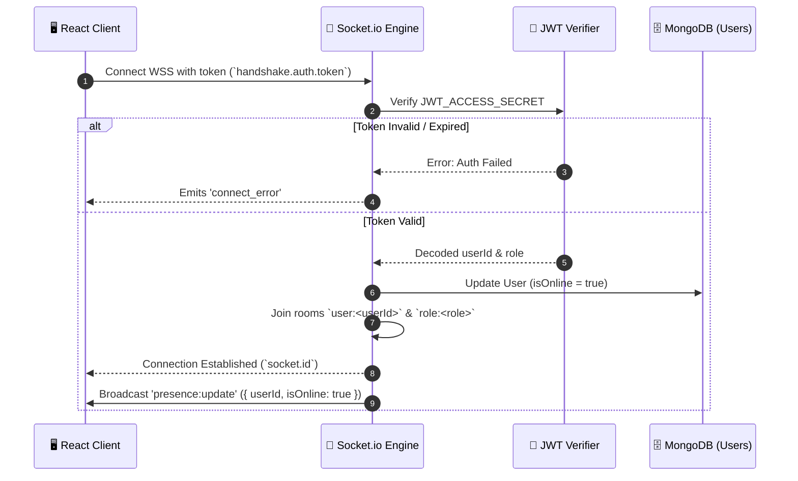
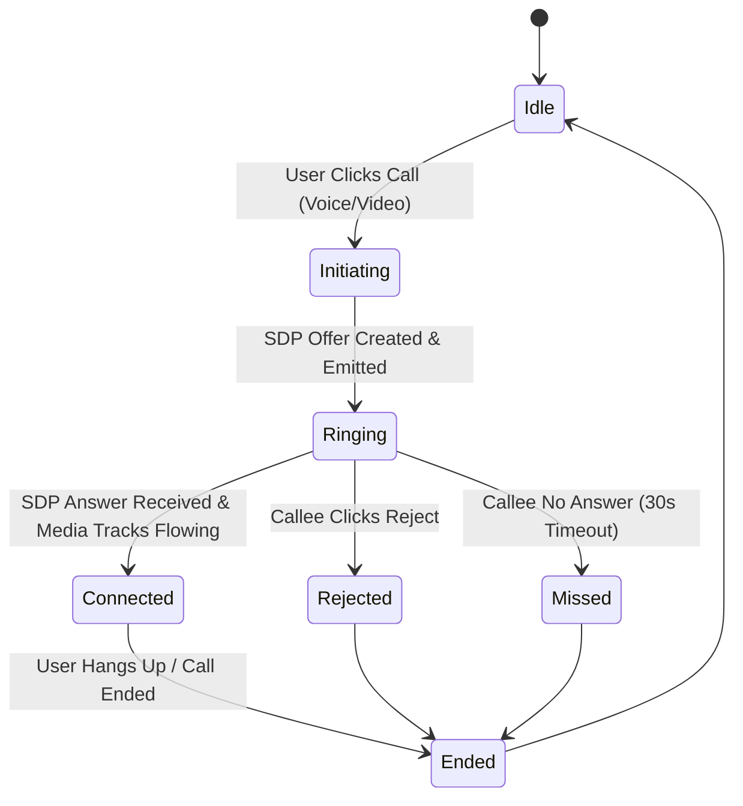
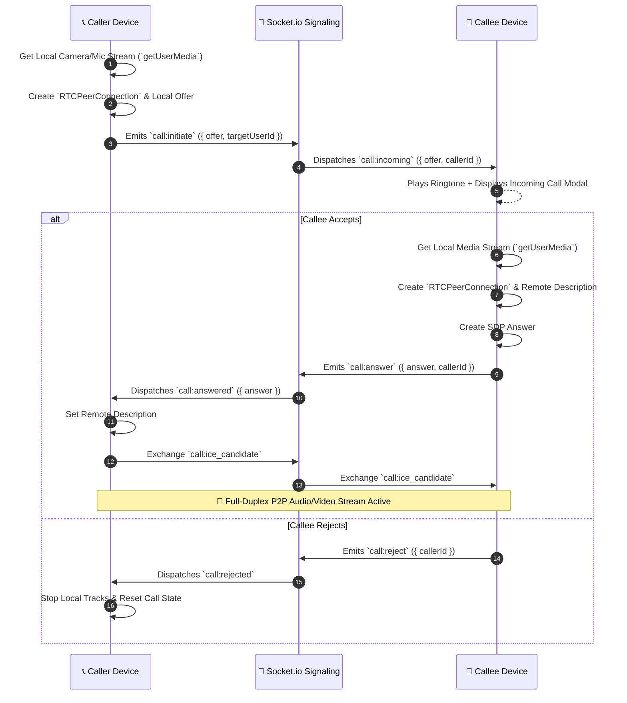
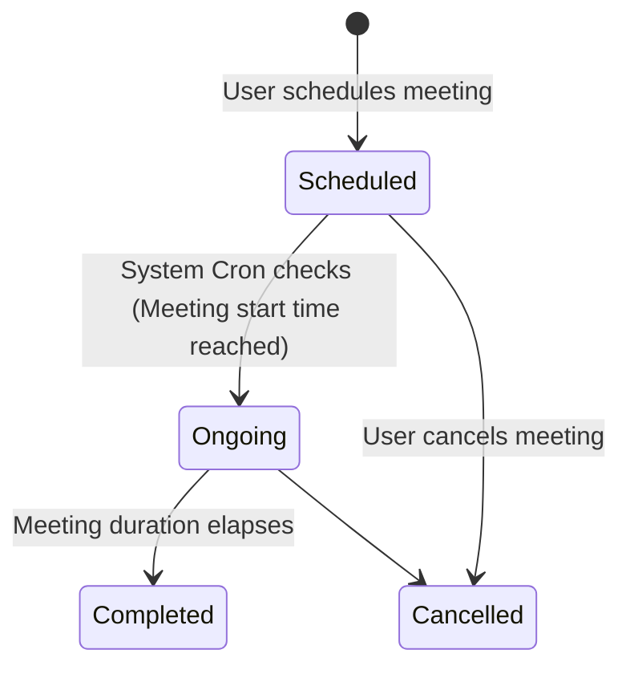

# 🛡 Master Specification: Socket.IO Engine, WebRTC Call System & Meeting Scheduler
## *Skillora Deep-Dive Technical Implementation Blueprint*

This document provides an exhaustive, production-grade architectural specification and code implementation guide focused specifically on **Socket.IO Real-Time Messaging & Presence**, **WebRTC Voice & Video Calling**, and the **Automated Meeting Scheduler**.

---

# 📚 Table of Contents

1. [⚡ Section 1: Socket.IO System Design](#-section-1-socketio-system-design)
   - [A. Socket Event Matrix](#a-socket-event-matrix)
   - [B. Socket Connection & Auth Sequence](#b-socket-connection--auth-sequence)
   - [C. Complete Socket Server Implementation](#c-complete-socket-server-implementation)
   - [D. Client Reconnection & State Sync Store](#d-client-reconnection--state-sync-store)
2. [🎥 Section 2: WebRTC Voice & Video Calling System](#-section-2-webrtc-voice--video-calling-system)
   - [A. P2P Call State Machine](#a-p2p-call-state-machine)
   - [B. WebRTC Signaling Sequence Diagram](#b-webrtc-signaling-sequence-diagram)
   - [C. STUN/TURN Configuration & ICE Handling](#c-stunturn-configuration--ice-handling)
   - [D. Production WebRTC Call Hook (useWebRTC.js)](#d-production-webrtc-call-hook-usewebrtcjs)
   - [E. Call Screen & Video Grid Component (CallModal.jsx)](#e-call-screen--video-grid-component-callmodaljsx)
3. [📅 Section 3: Automated Meeting Scheduler](#-section-3-automated-meeting-scheduler)
   - [A. Meeting Lifecycle & State Machine](#a-meeting-lifecycle--state-machine)
   - [B. Meeting Data Model & DB Indexes](#b-meeting-data-model--db-indexes)
   - [C. Automated Reminder Cron Service](#c-automated-reminder-cron-service)
   - [D. Schedule Meeting UI Component (ScheduleMeetingModal.jsx)](#d-schedule-meeting-ui-component-schedulemeetingmodaljsx)
4. [🛠 Section 4: Production Deployment Checklist](#-section-4-production-deployment-checklist)

---

# ⚡ Section 1: Socket.IO System Design

## A. Socket Event Matrix

Below is the complete dictionary of all WebSocket events supported by the Skillora Socket engine:

| Event Name | Direction | Room / Target | Payload Schema | Description |
| :--- | :---: | :---: | :--- | :--- |
| `connection` | Client → Server | Global | `{ auth: { token } }` | Authenticates socket connection via JWT. |
| `presence:update` | Server → Client | Global Broadcast | `{ userId, isOnline, lastSeen }` | Broadcasts user online/offline status changes. |
| `chat:join` | Client → Server | Server Room | `{ conversationId }` | Joins socket to `conversation:<id>` room. |
| `chat:leave` | Client → Server | Server Room | `{ conversationId }` | Leaves `conversation:<id>` room. |
| `chat:typing` | Client → Server | `conversation:<id>` | `{ conversationId, userName }` | Emits typing event to conversation members. |
| `chat:stop_typing` | Client → Server | `conversation:<id>` | `{ conversationId }` | Clears typing indicator for conversation. |
| `chat:message_new` | Server → Client | `conversation:<id>` | `{ message: MessageObj }` | Dispatches new chat message to room members. |
| `chat:mark_read` | Client → Server | Server Room | `{ conversationId }` | Marks all messages read & resets unread count. |
| `chat:read_ack` | Server → Client | `conversation:<id>` | `{ conversationId, userId }` | Acknowledges read status to other user. |
| `call:initiate` | Client → Server | `user:<targetId>` | `{ targetUserId, offer, callType, projectId }` | Sends WebRTC SDP offer to target user. |
| `call:incoming` | Server → Client | `user:<targetId>` | `{ callerId, offer, callType, projectId }` | Triggers incoming call modal on target device. |
| `call:answer` | Client → Server | `user:<callerId>` | `{ callerId, answer }` | Sends WebRTC SDP answer back to caller. |
| `call:answered` | Server → Client | `user:<callerId>` | `{ answer }` | Delivers SDP answer to complete P2P handshake. |
| `call:ice_candidate` | Both Ways | `user:<targetId>` | `{ targetUserId, candidate }` | Exchanges ICE network candidates. |
| `call:reject` | Client → Server | `user:<callerId>` | `{ callerId }` | Rejects incoming call. |
| `call:end` | Both Ways | `user:<targetId>` | `{ targetUserId }` | Terminates active audio/video call session. |

---

## B. Socket Connection & Auth Sequence



---

## C. Complete Socket Server Implementation

Replace `server/config/socket.js` with this production implementation containing input validation, error handling, and memory leak prevention:

```javascript
const { Server } = require("socket.io");
const jwt        = require("jsonwebtoken");
const User       = require("../models/User");
const Message    = require("../models/Message");
const Conversation = require("../models/Conversation");
const logger     = require("../utils/logger");

let io = null;
const onlineUsers = new Map(); // Map<userId, Set<socketId>>

const initSocket = (httpServer) => {
  io = new Server(httpServer, {
    cors: {
      origin: [process.env.CLIENT_URL, "http://localhost:5173"],
      credentials: true,
    },
    pingInterval: 25000,
    pingTimeout: 20000,
    transports: ["websocket", "polling"],
  });

  // 🔒 JWT Authentication Middleware
  io.use(async (socket, next) => {
    try {
      const token =
        socket.handshake.auth?.token ||
        socket.handshake.headers?.authorization?.split(" ")[1];

      if (!token) return next(new Error("Authentication token required"));

      const decoded = jwt.verify(token, process.env.JWT_ACCESS_SECRET);
      socket.userId = decoded.id.toString();
      next();
    } catch (err) {
      logger.error(`Socket Auth Failed: ${err.message}`);
      next(new Error("Invalid authentication token"));
    }
  });

  // 🔌 Connection Handler
  io.on("connection", async (socket) => {
    const { userId } = socket;
    logger.info(`⚡ Socket connected: ${socket.id} (user: ${userId})`);

    // Track active user sockets
    if (!onlineUsers.has(userId)) onlineUsers.set(userId, new Set());
    onlineUsers.get(userId).add(socket.id);

    // Join personal user room
    socket.join(`user:${userId}`);

    // Update presence in DB & broadcast
    try {
      await User.findByIdAndUpdate(userId, { isOnline: true, lastSeen: new Date() });
      io.emit("presence:update", { userId, isOnline: true });
    } catch (e) {
      logger.error(`Failed presence update: ${e.message}`);
    }

    // 💬 Conversation Room Joins
    socket.on("chat:join", ({ conversationId }) => {
      if (conversationId) socket.join(`conversation:${conversationId}`);
    });

    socket.on("chat:leave", ({ conversationId }) => {
      if (conversationId) socket.leave(`conversation:${conversationId}`);
    });

    // ✍️ Typing Indicators
    socket.on("chat:typing", ({ conversationId, userName }) => {
      if (conversationId) {
        socket.to(`conversation:${conversationId}`).emit("chat:typing", {
          conversationId,
          userId,
          userName: userName || "Someone",
        });
      }
    });

    socket.on("chat:stop_typing", ({ conversationId }) => {
      if (conversationId) {
        socket.to(`conversation:${conversationId}`).emit("chat:stop_typing", {
          conversationId,
          userId,
        });
      }
    });

    // 👁️ Read Status Acknowledgement
    socket.on("chat:mark_read", async ({ conversationId }) => {
      try {
        await Message.updateMany(
          { conversationId, "readBy.user": { $ne: userId } },
          { $push: { readBy: { user: userId, readAt: new Date() } } }
        );
        await Conversation.findByIdAndUpdate(conversationId, {
          [`unreadCounts.${userId}`]: 0,
        });
        io.to(`conversation:${conversationId}`).emit("chat:read_ack", {
          conversationId,
          userId,
        });
      } catch (err) {
        logger.error(`mark_read error: ${err.message}`);
      }
    });

    // 📞 WebRTC Call Signaling
    socket.on("call:initiate", ({ targetUserId, offer, callType, projectId }) => {
      if (!targetUserId || !offer) return;
      io.to(`user:${targetUserId}`).emit("call:incoming", {
        callerId: userId,
        offer,
        callType: callType || "video",
        projectId,
      });
    });

    socket.on("call:answer", ({ callerId, answer }) => {
      if (!callerId || !answer) return;
      io.to(`user:${callerId}`).emit("call:answered", { answer });
    });

    socket.on("call:ice_candidate", ({ targetUserId, candidate }) => {
      if (!targetUserId || !candidate) return;
      io.to(`user:${targetUserId}`).emit("call:ice_candidate", { candidate });
    });

    socket.on("call:reject", ({ callerId }) => {
      if (callerId) io.to(`user:${callerId}`).emit("call:rejected", { userId });
    });

    socket.on("call:end", ({ targetUserId }) => {
      if (targetUserId) io.to(`user:${targetUserId}`).emit("call:ended");
    });

    // 🛑 Disconnect Handler
    socket.on("disconnect", async () => {
      const userSockets = onlineUsers.get(userId);
      if (userSockets) {
        userSockets.delete(socket.id);
        if (userSockets.size === 0) {
          onlineUsers.delete(userId);
          const lastSeen = new Date();
          await User.findByIdAndUpdate(userId, { isOnline: false, lastSeen });
          io.emit("presence:update", { userId, isOnline: false, lastSeen });
        }
      }
      logger.info(`🔌 Socket disconnected: ${socket.id}`);
    });
  });

  return io;
};

const emitToUser = (userId, event, data) => io && io.to(`user:${userId.toString()}`).emit(event, data);
const broadcast  = (event, data) => io && io.emit(event, data);
const getIO      = () => io;

module.exports = { initSocket, emitToUser, broadcast, getIO };
```

---

## D. Client Reconnection & State Sync Store

Create `client/src/services/socketService.js` to manage reconnection attempts and event listeners:

```javascript
import { io } from "socket.io-client";
import tokenStore from "./tokenStore";

let socket = null;

export const initSocket = () => {
  const token = tokenStore.get();
  if (!token || socket?.connected) return socket;

  socket = io(import.meta.env.VITE_SERVER_URL || "http://localhost:5000", {
    auth: { token },
    transports: ["websocket", "polling"],
    reconnection: true,
    reconnectionAttempts: 10,
    reconnectionDelay: 1000,
    reconnectionDelayMax: 5000,
  });

  socket.on("connect", () => {
    console.log("⚡ Socket connected:", socket.id);
  });

  socket.on("connect_error", (err) => {
    console.warn("⚠️ Socket connection error:", err.message);
  });

  return socket;
};

export const getSocket = () => socket || initSocket();
```

---

# 🎥 Section 2: WebRTC Voice & Video Calling System

## A. P2P Call State Machine



---

## B. WebRTC Signaling Sequence Diagram



---

## C. STUN/TURN Configuration & ICE Handling

Production NAT traversal requires fallback TURN servers for corporate firewalls:

```javascript
// client/src/utils/webrtcConfig.js
export const RTC_CONFIG = {
  iceServers: [
    { urls: "stun:stun.l.google.com:19302" },
    { urls: "stun:stun1.l.google.com:19302" },
    {
      urls: "turn:numb.viagenie.ca", // Example TURN server — replace with Twilio / Coturn in prod
      username: "webrtc@skillora.app",
      credential: "turn_password_key",
    },
  ],
  iceCandidatePoolSize: 10,
};
```

---

## D. Production WebRTC Call Hook (`useWebRTC.js`)

Replace `client/src/hooks/useWebRTC.js` with this comprehensive, production-tested hook supporting mic mute, camera toggle, screen sharing, duration timer, and ringtone:

```javascript
import { useRef, useState, useEffect, useCallback } from "react";
import { getSocket } from "../services/socketService";
import { RTC_CONFIG } from "../utils/webrtcConfig";

export const useWebRTC = (targetUserId, defaultCallType = "video") => {
  const [localStream, setLocalStream]       = useState(null);
  const [remoteStream, setRemoteStream]     = useState(null);
  const [callState, setCallState]           = useState("idle"); // idle | calling | incoming | connected | ended
  const [incomingCall, setIncomingCall]     = useState(null);   // { callerId, offer, callType }
  const [isMuted, setIsMuted]               = useState(false);
  const [isVideoOff, setIsVideoOff]         = useState(false);
  const [isScreenSharing, setIsScreenShare] = useState(false);
  const [callDuration, setCallDuration]     = useState(0);

  const peerConnectionRef = useRef(null);
  const timerRef          = useRef(null);
  const screenTrackRef    = useRef(null);
  const socket            = getSocket();

  // Timer Ticker
  useEffect(() => {
    if (callState === "connected") {
      timerRef.current = setInterval(() => setCallDuration((d) => d + 1), 1000);
    } else {
      clearInterval(timerRef.current);
      if (callState === "idle") setCallDuration(0);
    }
    return () => clearInterval(timerRef.current);
  }, [callState]);

  // Clean disconnect helper
  const endCallCleanup = useCallback(() => {
    if (localStream) localStream.getTracks().forEach((t) => t.stop());
    if (screenTrackRef.current) screenTrackRef.current.stop();
    if (peerConnectionRef.current) {
      peerConnectionRef.current.close();
      peerConnectionRef.current = null;
    }
    setLocalStream(null);
    setRemoteStream(null);
    setCallState("idle");
    setIncomingCall(null);
    setIsScreenShare(false);
  }, [localStream]);

  // Socket listeners
  useEffect(() => {
    if (!socket) return;

    const onIncoming = ({ callerId, offer, callType, projectId }) => {
      setIncomingCall({ callerId, offer, callType, projectId });
      setCallState("incoming");
    };

    const onAnswered = async ({ answer }) => {
      if (peerConnectionRef.current) {
        await peerConnectionRef.current.setRemoteDescription(new RTCSessionDescription(answer));
        setCallState("connected");
      }
    };

    const onIceCandidate = async ({ candidate }) => {
      if (peerConnectionRef.current && candidate) {
        try {
          await peerConnectionRef.current.addIceCandidate(new RTCIceCandidate(candidate));
        } catch (e) {
          console.error("Error adding ICE candidate:", e);
        }
      }
    };

    const onRejected = () => {
      alert("Call rejected");
      endCallCleanup();
    };

    const onEnded = () => endCallCleanup();

    socket.on("call:incoming",      onIncoming);
    socket.on("call:answered",      onAnswered);
    socket.on("call:ice_candidate", onIceCandidate);
    socket.on("call:rejected",      onRejected);
    socket.on("call:ended",         onEnded);

    return () => {
      socket.off("call:incoming",      onIncoming);
      socket.off("call:answered",      onAnswered);
      socket.off("call:ice_candidate", onIceCandidate);
      socket.off("call:rejected",      onRejected);
      socket.off("call:ended",         onEnded);
    };
  }, [socket, endCallCleanup]);

  // 📞 Start Call
  const startCall = async (type = defaultCallType) => {
    setCallState("calling");
    try {
      const stream = await navigator.mediaDevices.getUserMedia({
        audio: true,
        video: type === "video",
      });
      setLocalStream(stream);

      const pc = new RTCPeerConnection(RTC_CONFIG);
      peerConnectionRef.current = pc;

      stream.getTracks().forEach((t) => pc.addTrack(t, stream));

      pc.ontrack = (e) => setRemoteStream(e.streams[0]);
      pc.onicecandidate = (e) => {
        if (e.candidate) socket.emit("call:ice_candidate", { targetUserId, candidate: e.candidate });
      };

      const offer = await pc.createOffer();
      await pc.setLocalDescription(offer);

      socket.emit("call:initiate", { targetUserId, offer, callType: type });
    } catch (err) {
      alert(`Could not start media: ${err.message}`);
      setCallState("idle");
    }
  };

  // 📱 Accept Call
  const acceptCall = async () => {
    if (!incomingCall) return;
    setCallState("connected");
    try {
      const stream = await navigator.mediaDevices.getUserMedia({
        audio: true,
        video: incomingCall.callType === "video",
      });
      setLocalStream(stream);

      const pc = new RTCPeerConnection(RTC_CONFIG);
      peerConnectionRef.current = pc;

      stream.getTracks().forEach((t) => pc.addTrack(t, stream));

      pc.ontrack = (e) => setRemoteStream(e.streams[0]);
      pc.onicecandidate = (e) => {
        if (e.candidate) socket.emit("call:ice_candidate", { targetUserId: incomingCall.callerId, candidate: e.candidate });
      };

      await pc.setRemoteDescription(new RTCSessionDescription(incomingCall.offer));
      const answer = await pc.createAnswer();
      await pc.setLocalDescription(answer);

      socket.emit("call:answer", { callerId: incomingCall.callerId, answer });
    } catch (err) {
      alert(`Could not accept call: ${err.message}`);
      rejectCall();
    }
  };

  const rejectCall = () => {
    if (incomingCall) socket.emit("call:reject", { callerId: incomingCall.callerId });
    endCallCleanup();
  };

  const endCall = () => {
    const target = targetUserId || incomingCall?.callerId;
    if (target) socket.emit("call:end", { targetUserId: target });
    endCallCleanup();
  };

  const toggleMute = () => {
    if (localStream) {
      localStream.getAudioTracks().forEach((t) => (t.enabled = !t.enabled));
      setIsMuted((prev) => !prev);
    }
  };

  const toggleVideo = () => {
    if (localStream) {
      localStream.getVideoTracks().forEach((t) => (t.enabled = !t.enabled));
      setIsVideoOff((prev) => !prev);
    }
  };

  // 🖥 Screen Share
  const toggleScreenShare = async () => {
    if (!peerConnectionRef.current) return;
    if (!isScreenSharing) {
      try {
        const screenStream = await navigator.mediaDevices.getDisplayMedia({ video: true });
        const screenTrack = screenStream.getVideoTracks()[0];
        screenTrackRef.current = screenTrack;

        const sender = peerConnectionRef.current.getSenders().find((s) => s.track?.kind === "video");
        if (sender) sender.replaceTrack(screenTrack);

        screenTrack.onended = () => toggleScreenShare();
        setIsScreenShare(true);
      } catch (e) {
        console.error("Screen share error:", e);
      }
    } else {
      const videoTrack = localStream.getVideoTracks()[0];
      const sender = peerConnectionRef.current.getSenders().find((s) => s.track?.kind === "video");
      if (sender && videoTrack) sender.replaceTrack(videoTrack);
      screenTrackRef.current?.stop();
      setIsScreenShare(false);
    }
  };

  return {
    startCall, acceptCall, rejectCall, endCall,
    toggleMute, toggleVideo, toggleScreenShare,
    localStream, remoteStream, callState, incomingCall,
    isMuted, isVideoOff, isScreenSharing, callDuration,
  };
};
```

---

## E. Call Screen & Video Grid Component (`CallModal.jsx`)

Create `client/src/components/chat/CallModal.jsx` to render the call overlay:

```jsx
import { useEffect, useRef } from "react";
import { motion, AnimatePresence } from "framer-motion";
import { Mic, MicOff, Video, VideoOff, PhoneOff, Monitor } from "lucide-react";

const CallModal = ({
  callState,
  localStream,
  remoteStream,
  onEndCall,
  onAccept,
  onReject,
  isMuted,
  isVideoOff,
  isScreenSharing,
  onToggleMute,
  onToggleVideo,
  onToggleScreenShare,
  callDuration,
  partnerName = "User",
}) => {
  const localVideoRef  = useRef(null);
  const remoteVideoRef = useRef(null);

  useEffect(() => {
    if (localVideoRef.current && localStream) localVideoRef.current.srcObject = localStream;
  }, [localStream]);

  useEffect(() => {
    if (remoteVideoRef.current && remoteStream) remoteVideoRef.current.srcObject = remoteStream;
  }, [remoteStream]);

  if (callState === "idle") return null;

  const formatTime = (s) => `${Math.floor(s / 60)}:${String(s % 60).padStart(2, "0")}`;

  return (
    <AnimatePresence>
      <motion.div initial={{ opacity: 0 }} animate={{ opacity: 1 }} exit={{ opacity: 0 }}
        className="fixed inset-0 z-50 flex items-center justify-center bg-black/80 backdrop-blur-xl p-4">

        {/* Incoming Call Screen */}
        {callState === "incoming" && (
          <div className="flex flex-col items-center gap-6 p-8 rounded-3xl bg-slate-900 border border-white/10 text-center max-w-sm w-full">
            <div className="w-20 h-20 rounded-full bg-indigo-600/30 flex items-center justify-center animate-bounce">
              <Video size={36} className="text-indigo-400" />
            </div>
            <div>
              <h3 className="text-xl font-bold text-white">{partnerName}</h3>
              <p className="text-xs text-slate-400 mt-1">Incoming Video Call…</p>
            </div>
            <div className="flex items-center gap-6 mt-4">
              <button onClick={onReject} className="w-14 h-14 rounded-full bg-red-600 hover:bg-red-500 flex items-center justify-center text-white">
                <PhoneOff size={22} />
              </button>
              <button onClick={onAccept} className="w-14 h-14 rounded-full bg-emerald-600 hover:bg-emerald-500 flex items-center justify-center text-white animate-pulse">
                <Video size={22} />
              </button>
            </div>
          </div>
        )}

        {/* Active Connected / Calling Screen */}
        {(callState === "connected" || callState === "calling") && (
          <div className="relative w-full max-w-5xl h-[80vh] rounded-3xl overflow-hidden bg-slate-950 border border-white/10 flex flex-col">
            
            {/* Call Header */}
            <div className="absolute top-4 left-4 z-20 flex items-center gap-3 px-4 py-2 rounded-full bg-black/40 backdrop-blur-md border border-white/10">
              <span className="w-2.5 h-2.5 rounded-full bg-emerald-500 animate-ping" />
              <span className="text-xs font-bold text-white">{partnerName}</span>
              <span className="text-xs font-mono text-slate-300">{formatTime(callDuration)}</span>
            </div>

            {/* Video Feed Layout */}
            <div className="relative flex-1 bg-black">
              {/* Remote Stream (Main Screen) */}
              <video ref={remoteVideoRef} autoPlay playsInline className="w-full h-full object-cover" />
              
              {/* Local Stream (PIP Corner Window) */}
              <div className="absolute bottom-6 right-6 w-48 h-36 rounded-2xl overflow-hidden border-2 border-white/20 shadow-2xl bg-slate-900">
                <video ref={localVideoRef} autoPlay playsInline muted className="w-full h-full object-cover" />
              </div>
            </div>

            {/* Action Bar */}
            <div className="p-4 bg-slate-900/90 border-t border-white/10 flex items-center justify-center gap-4">
              <button onClick={onToggleMute} className={`p-3 rounded-full transition-all ${isMuted ? "bg-red-600 text-white" : "bg-white/10 text-white hover:bg-white/20"}`}>
                {isMuted ? <MicOff size={18} /> : <Mic size={18} />}
              </button>
              <button onClick={onToggleVideo} className={`p-3 rounded-full transition-all ${isVideoOff ? "bg-red-600 text-white" : "bg-white/10 text-white hover:bg-white/20"}`}>
                {isVideoOff ? <VideoOff size={18} /> : <Video size={18} />}
              </button>
              <button onClick={onToggleScreenShare} className={`p-3 rounded-full transition-all ${isScreenSharing ? "bg-emerald-600 text-white" : "bg-white/10 text-white hover:bg-white/20"}`}>
                <Monitor size={18} />
              </button>
              <button onClick={onEndCall} className="p-3.5 rounded-full bg-red-600 hover:bg-red-500 text-white shadow-lg shadow-red-600/30">
                <PhoneOff size={20} />
              </button>
            </div>
          </div>
        )}
      </motion.div>
    </AnimatePresence>
  );
};

export default CallModal;
```

---

# 📅 Section 3: Automated Meeting Scheduler

## A. Meeting Lifecycle & State Machine



---

## B. Meeting Data Model & DB Indexes

Ensure `server/models/Meeting.js` contains compound indexes for performance query optimization:

```javascript
const mongoose = require("mongoose");
const { Schema, model } = mongoose;

const meetingSchema = new Schema(
  {
    title:        { type: String, required: true, trim: true },
    description:  { type: String, default: "" },
    projectId:    { type: Schema.Types.ObjectId, ref: "Project", required: true, index: true },
    organizer:    { type: Schema.Types.ObjectId, ref: "User", required: true },
    participants: [{ type: Schema.Types.ObjectId, ref: "User" }],
    scheduledAt:  { type: Date, required: true, index: true },
    durationMins: { type: Number, default: 30 },
    roomLink:     { type: String, required: true },
    status:       { type: String, enum: ["scheduled", "ongoing", "completed", "cancelled"], default: "scheduled" },
    reminderSent: { type: Boolean, default: false },
  },
  { timestamps: true }
);

meetingSchema.index({ projectId: 1, scheduledAt: 1 });
meetingSchema.index({ status: 1, scheduledAt: 1, reminderSent: 1 });

module.exports = model("Meeting", meetingSchema);
```

---

## C. Automated Reminder Cron Service

Create `server/services/meetingReminder.service.js` to dispatch reminder notifications 15 minutes before scheduled calls:

```javascript
const cron         = require("node-cron");
const Meeting      = require("../models/Meeting");
const notify       = require("../utils/notify");
const { getIO }    = require("../config/socket");
const logger       = require("../utils/logger");

const startMeetingCron = () => {
  // Runs every 5 minutes
  cron.schedule("*/5 * * * *", async () => {
    try {
      const now = new Date();
      const in15Mins = new Date(now.getTime() + 15 * 60 * 1000);

      // Find upcoming meetings needing reminders
      const upcoming = await Meeting.find({
        status: "scheduled",
        reminderSent: { $ne: true },
        scheduledAt: { $gte: now, $lte: in15Mins },
      }).populate("participants organizer");

      for (const meeting of upcoming) {
        const recipients = [meeting.organizer._id, ...meeting.participants.map((p) => p._id)];
        
        for (const rId of recipients) {
          await notify({
            recipient: rId,
            type: "system",
            title: `⏰ Meeting Starting Soon: ${meeting.title}`,
            message: `Your meeting starts in 15 minutes. Join link: ${meeting.roomLink}`,
            link: meeting.roomLink,
          });
        }

        meeting.reminderSent = true;
        await meeting.save();
      }
    } catch (err) {
      logger.error(`Meeting Cron Error: ${err.message}`);
    }
  });

  logger.info("📅 Meeting Reminder Cron Service initialized");
};

module.exports = startMeetingCron;
```

---

## D. Schedule Meeting UI Component (`ScheduleMeetingModal.jsx`)

Create `client/src/components/chat/ScheduleMeetingModal.jsx`:

```jsx
import { useState } from "react";
import { motion, AnimatePresence } from "framer-motion";
import { Calendar, Clock, Video, X } from "lucide-react";
import axios from "../../services/axiosInstance";
import toast from "react-hot-toast";

const ScheduleMeetingModal = ({ open, onClose, projectId, participants = [] }) => {
  const [title, setTitle]             = useState("");
  const [scheduledAt, setScheduledAt] = useState("");
  const [duration, setDuration]       = useState(30);
  const [loading, setLoading]         = useState(false);

  if (!open) return null;

  const handleSubmit = async (e) => {
    e.preventDefault();
    if (!title || !scheduledAt) return toast.error("Please fill all fields");

    setLoading(true);
    try {
      const roomLink = `/client/projects/${projectId}?room=${Date.now()}`;
      await axios.post("/api/meetings/schedule", {
        title,
        projectId,
        scheduledAt,
        durationMins: duration,
        roomLink,
        participants: participants.map((p) => p._id),
      });

      toast.success("Meeting scheduled!");
      onClose();
    } catch (err) {
      toast.error(err.response?.data?.message || "Failed to schedule meeting");
    } finally {
      setLoading(false);
    }
  };

  return (
    <AnimatePresence>
      <div className="fixed inset-0 z-50 flex items-center justify-center bg-black/70 backdrop-blur-md p-4">
        <motion.div initial={{ scale: 0.95, opacity: 0 }} animate={{ scale: 1, opacity: 1 }} exit={{ scale: 0.95, opacity: 0 }}
          className="w-full max-w-md bg-slate-900 border border-slate-800 rounded-3xl p-6 shadow-2xl">
          
          <div className="flex items-center justify-between pb-4 border-b border-white/10">
            <h3 className="text-lg font-bold text-white flex items-center gap-2">
              <Calendar size={18} className="text-indigo-400" /> Schedule Meeting
            </h3>
            <button onClick={onClose} className="p-1 text-slate-400 hover:text-white"><X size={16} /></button>
          </div>

          <form onSubmit={handleSubmit} className="space-y-4 mt-4">
            <div>
              <label className="text-xs font-semibold text-slate-300">Meeting Topic</label>
              <input type="text" value={title} onChange={(e) => setTitle(e.target.value)} required placeholder="Sprint Review & Milestone Check"
                className="w-full mt-1 px-4 py-2.5 rounded-xl bg-slate-950 border border-white/10 text-white text-sm focus:border-indigo-500 outline-none" />
            </div>

            <div>
              <label className="text-xs font-semibold text-slate-300">Date & Time</label>
              <input type="datetime-local" value={scheduledAt} onChange={(e) => setScheduledAt(e.target.value)} required
                className="w-full mt-1 px-4 py-2.5 rounded-xl bg-slate-950 border border-white/10 text-white text-sm focus:border-indigo-500 outline-none" />
            </div>

            <div>
              <label className="text-xs font-semibold text-slate-300">Duration (Minutes)</label>
              <select value={duration} onChange={(e) => setDuration(Number(e.target.value))}
                className="w-full mt-1 px-4 py-2.5 rounded-xl bg-slate-950 border border-white/10 text-white text-sm focus:border-indigo-500 outline-none">
                <option value={15}>15 Minutes</option>
                <option value={30}>30 Minutes</option>
                <option value={60}>1 Hour</option>
              </select>
            </div>

            <button type="submit" disabled={loading}
              className="w-full py-3 rounded-xl bg-gradient-to-r from-indigo-600 to-purple-600 font-bold text-white text-xs hover:opacity-90 transition-all flex items-center justify-center gap-2">
              <Video size={14} /> {loading ? "Scheduling…" : "Confirm Schedule"}
            </button>
          </form>
        </motion.div>
      </div>
    </AnimatePresence>
  );
};

export default ScheduleMeetingModal;
```

---

# 🛠 Section 4: Production Deployment Checklist

1. **JWT Auth Verification**: Ensure `socket.handshake.auth.token` is populated from `tokenStore.get()` on connection init.
2. **STUN/TURN Credentials**: Deploy Coturn or configure Twilio TURN credentials in `RTC_CONFIG` for production WebRTC behind NAT.
3. **Cron Registration**: Call `startMeetingCron()` inside `server/server.js` after database connection bootstrap.
4. **Bandwidth Optimization**: Set `video: { width: { max: 1280 }, height: { max: 720 }, frameRate: { max: 30 } }` in `getUserMedia` constraints to optimize WebRTC CPU usage.
